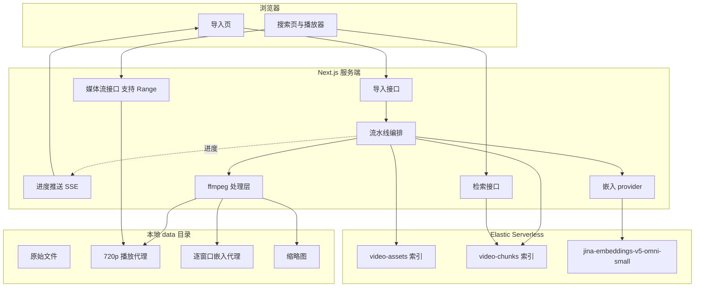

# 架构与数据流（中文）

本文是 `plan/00-implementation-plan.md` 的中文要点版，供快速理解整体设计与关键取舍。
详细实施步骤请看英文计划文档。

## 一句话概括

用 Next.js 全栈搭一个视频语义检索演示站：ffmpeg 按 64 秒窗口（4 秒重叠）切片，
每个窗口生成「画面向量 + 语音向量」两个向量（Jina v5 omni，经 Elastic Inference
Service），以 `dense_vector` 加时间码元数据写入 Elastic Serverless；前端输入一句
话就能定位到视频里的某个时刻并直接从那里播放。

## 三个必须先讲清的技术事实

这三条决定了整个设计，都是查证过的，不是推测。

**第一，omni 处理视频时只均匀抽 32 帧。** 不管你送进去的是 4 秒还是 64 秒，模型看到
的都是 32 帧。所以把字节预算花在「真实时长的视频」上是浪费——同样的体积，应该全部
花在这 32 帧的画质上。

**第二，二进制输入有大小上限，而且有两个不同的闸门。**

- Elasticsearch 侧：`indices.inference.max_binary_input_size`，默认 1 MB。自管和
  Cloud Hosted 可以调到 20 MB，**Serverless 固定 1 MB，改不了**。
- Jina 侧：每个输入 10 MB（图片另有 5 MB、PDF 8 MB 的明文规定）。

之前提到的 75 MB，在 Elastic 和 Jina 的官方文档、以及 Jina 的 OpenAPI 规范里都查不
到出处。10 MB 这个数字是对的，但它属于 Jina 直连 API 那条路；本项目选的是 Elastic
Serverless + EIS，受 1 MB 约束。

还有一个悬而未决的点：这个 1 MB 的说明写在 `semantic` 字段的文档页上，而我们走的是
直接调 `_inference/embedding/`，文档没说这两条是不是同一个闸门。**这个不猜，实测。**
实施第一步就是跑一个能力探测脚本，依次送 0.9 / 2 / 5 / 10 MB 的测试片段，看哪个开始
报 400，把实测值写进 `.env`，编码器按这个预算自动调参。无论真相是哪个数字，代码都不
用改。

**第三，模型对小图会强行上采样。** 小于 262,144 像素（相当于 512×512）的输入会被放
大。所以分辨率降到 720×405（约 291,000 像素）就是有意义的下限，再往下压只丢信息、不
省 token。

## 整体架构

## 导入与嵌入的数据流

1. 用户在导入页选择模式（URL / 本地路径 / 上传），填写信息并提交。
2. 服务端按模式做针对性校验：URL 要防 SSRF（拒绝私有网段、回环、link-local 地址）；
   本地路径要 `realpath` 后确认落在 `LOCAL_IMPORT_ROOT` 之内（防路径穿越）；上传要流式
   落盘不进内存。三者最后统一用 `ffprobe` 验证确实是能解码的视频。
3. 创建任务并返回任务 ID，前端通过 SSE 订阅进度。
4. `ffprobe` 探测时长、分辨率、帧率、是否有音轨。
5. 如果分辨率超过 720p 或编码格式浏览器不友好，生成 720p H.264 播放代理（带
   faststart）；否则直接用原文件播放。
6. 按 `stride = 窗口 - 重叠`（默认 64000 - 4000 = 60000 毫秒）切出窗口列表，末尾不足
   `CHUNK_MIN_MS` 的残片并入前一个窗口。
7. 对每个窗口做三件事：抽 32 帧编成视频代理、切一段 16 kHz 单声道 Opus 音频代理、取中
   间帧做缩略图。
8. 视频代理和音频代理各自调一次推理，得到两个向量。
9. 批量写入 `video-chunks`，文档 `_id` 用 `{video_id}_{chunk_index}`，重跑是覆盖而不
   是产生重复。

## 为什么做「双轨嵌入」

1 MB 的预算下，想让一个片段同时带上清晰的画面和完整的音轨是不现实的。但**视频代理和
音频代理是两次独立的推理调用，各自都能吃满整个预算**。所以每个窗口产出两个向量：

- `embedding_video`：来自 32 帧代理视频，不带音轨
- `embedding_audio`：来自同一时间范围的独立音频片段，源视频无音轨时跳过

好处是文本查询既能命中画面内容，也能命中台词和声音，检索结果还能标注是靠哪个模态命中
的。代价是推理调用翻倍。64 秒的音频压到 16 kbps 大约 128 KB，即使在 1 MB 预算下也很
宽裕——而且模型本来就要把音频重采样到 16 kHz 单声道，这一步几乎没有额外损失。

## 预算自适应编码

不写死分辨率和码率，而是逐级降档直到文件符合预算：

- 分辨率梯：1280×720 → 960×540 → 854×480 → 720×405 → 640×360
- CRF 梯：23 → 26 → 28 → 30 → 32

外层走分辨率，内层走 CRF，第一个达标的组合就用。实际用到哪一档会记录进 chunk 的
`video_proxy` 元数据，演示时可以直接讲清楚「预算换来了什么代价」。

## 为什么用显式 dense_vector 而不是 semantic 字段

Elastic 的 `semantic` 字段能自动完成嵌入，写法更省事，但它会把完整的 base64 data URL
留在 `_source` 里。按每片接近 1 MB 算，索引体积会膨胀好几个数量级。用显式
`dense_vector` 则：

- 符合原始需求里「以 dense vector 加 metadata 存入」的说法
- base64 完全不进 Elasticsearch，索引保持精简
- 可以自主控制 BBQ 量化和召回重打分

代价是要自己调推理接口、自己处理重试——但这本来也是需要的（限流退避、并发控制、token
统计）。

## 检索与播放

用 RRF 检索器融合画面和语音两路 `knn`。因为一个窗口就是一个文档，天然不需要去重或
collapse。UI 提供「只搜画面 / 只搜语音 / 两者」切换。

查询向量的生成方式取决于 provider：走 EIS 时交给 Elasticsearch 用
`query_vector_builder.embedding` 生成（针对 `dense_vector` 字段必须显式给
`inference_id`）；走 Jina 直连时在应用侧算好、归一化后以 `query_vector` 传入。

点击结果卡片，播放器 seek 到该窗口的 `start_ms`。播放器下方的时间轴条会标出当前视频里
所有命中的窗口，可以直接跳。能 seek 的前提是媒体接口支持 HTTP Range 请求。

## 关键取舍一览

- **64 秒窗口配 32 帧 = 每 2 秒才看 1 帧。** Elastic 官方 demo 用的是 2–18 秒的场景切
  分，模型卡也写明「短片段效果最优」。64 秒是需求明确指定的，所以保留为默认值，但同时
  提供 10 秒 / 2 秒的「精细模式」预设，让这个精度差异可以被实测出来，而不是停留在争论。
- **provider 可插拔，三条路。** 默认 EIS（不需要额外的 key，查询向量由 ES 侧生成）；
  切到 Jina 直连可以拿到 10 MB 预算、更高的片段质量；还可以切到**本地自托管**——Jina
  官方为 omni-small 提供了预构建容器（约 8 GB 内存），本机 `jina_repo/jina-airgap` 的
  catalog 里已经收录了这个模型，其服务端支持 base64 视频输入，体积上限只是它自己源码里
  的一个常量。三者同一个模型、都做 L2 归一化，向量可以在同一个索引里共存。
  - 本地这条路不是默认，但价值明确：它彻底移除体积预算这个约束，所以既是「万一 1 MB
    实在不够用」的退路，也是一个零成本的基准线——可以量出「预算到底让检索质量损失了多
    少」。代价是权重许可为 CC-BY-NC-4.0（仅限非商业用途），且 CPU 上跑 1.74B 模型处理
    32 帧视频会明显慢于托管服务。
- **原文件保留。** 三种导入模式都把文件存进本地 media store，播放体验统一。不删除任何
  文件，除非用户明确操作。

## 凭据与安全

`ELASTICSEARCH_URL`、`ELASTICSEARCH_API_KEY`、`JINA_API_KEY` 只存在 `.env` 里，
`.gitignore` 从第一次提交起就排除 `.env` 和 `data/`，仓库里只有 `.env.example`。配置读
取经 zod 校验，缺变量就在启动时报错，不会跑到一半才失败。对远端 Elasticsearch 的改动
（建索引、mapping）会先写进 `docs/data-model.md` 再执行。
