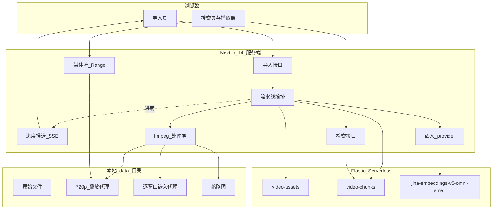

# 架构与数据流（中文）

本文是 `plan/00-implementation-plan.md` 的中文要点版，供快速理解整体设计与关键取舍。
详细实施步骤请看英文计划文档。与计划冲突时以英文计划与
`requirements/01-interpreted-requirements.md` 为准；本文件应与二者保持同步。

## 一句话概括

用 **Next.js 14 + React 18 + EUI** 全栈搭一个视频语义检索演示站：ffmpeg 按可选
分块预设（默认 64 秒窗口 / 4 秒重叠，亦可 60s / 30s / 20s / fine）切片，每个窗口
生成「画面向量 + 语音向量」两个向量（Jina v5 omni，经可插拔 provider），以
`dense_vector` 加时间码与 **变体身份** 写入 Elastic Serverless（目标 9.5）；前端
输入一句话就能定位到视频里的某个时刻并直接从那里播放。

## 三个必须先讲清的技术事实

**第一，omni 处理视频时只均匀抽 32 帧。** 不管送进去 4 秒还是 64 秒，模型看到的都是
32 帧。字节预算应优先花在这 32 帧的画质上（这是待检索验证的假设，不是已证明的优势）。

**第二，二进制输入上限按供应商分列，没有全局单一值。**

- **EIS + Serverless 文档：解码后 1 MB 固定**（运营预算仍用
  `EIS_MAX_BINARY_BYTES=1048576`）。
- **Phase 2 实测（2026-08-26，直接 `_inference/embedding`）：** 视频/音频解码
  媒体升至约 **3.1 MB** 仍未见到 size-limit 400（OQ1 部分解决）。更高上限未测。
- **托管 Jina API 的视频/音频上限：未知，未实测**（无 `JINA_API_KEY`，OQ2 仍开；
  OpenAPI 未写 size）。**不要写「托管 Jina = 10 MB」。**
- **本地 `jina-airgap` 参考服务：源码常量默认 10 MB**，可改，但改前不能当「无预算
  质量基线」。

Phase 2 按供应商实测，并写明测的是哪一层字节（本项目：`decoded_media`）。
结果写入 `EIS_MAX_BINARY_BYTES` / `JINA_MAX_BINARY_BYTES` /
`LOCAL_MAX_BINARY_BYTES`。详见 `docs/operations.md`。

**第三，模型对小图会强行上采样。** 小于 262,144 像素会被放大。720×405 是有意义的
下限；640×360 仅作字节合规的最后一档。梯度耗尽后按约定降帧数，再失败则标记
`ladder_exhausted` 并跳过该窗口。

## 版本矩阵与为何仍用 dense_vector

| 版本 | 能力 |
| --- | --- |
| 9.3+ | 可建端点、跑多模态 embedding；不可与 semantic_text 配 omni |
| 9.4+ | semantic_text 仅文本；omni 模型 GA |
| 9.5+ | `semantic` 字段支持全模态 |

目标 9.5，但仍选显式 `dense_vector`：可在 9.4 跑、base64 不进 `_source`、可控制
量化 / 模态标签 / RRF 权重。

## UI 技术栈（Round-4 更正）

- EUI 119.1.0：**不支持 React 19**。
- Next 15 最低 React 19；Next 16 App Router 使用 React 19.2 Canary。
- **采用 Next.js 14.2.35 + React 18.3.1 + EUI 119.1.0**（唯一双方官方 peer 都覆盖的组合）。
- EUI **仅客户端渲染**；yarn 为本项目钉死的包管理器（可复现性选择，非框架铁律）。
- 无 Tailwind。Phase 1 先做兼容性 spike，再铺脚手架。

## 整体架构

## 导入与嵌入的数据流

1. 用户选择单片（URL / 本地路径 / 上传）或**批量**（多文件上传 / 本地文件夹，无
   URL；一文件一部片），并可选分块预设后提交。
2. 校验：URL 防 SSRF（私有/回环拒绝、**重定向逐跳再校验**、连已校验 IP 并保留
   Host/TLS 名、**流式字节强制**、超时、部分文件隔离）；本地路径 `realpath` 落在
   `LOCAL_IMPORT_ROOT`；上传流式落盘。统一 `ffprobe`。
3. URL 溯源**脱敏**后入库（安全 origin+path + 单向指纹），原始带密钥的 URL 不回传、
   不进 ES。
4. 创建任务，SSE 推送进度。作业状态机与 SSE 事件契约见
   `docs/api-contract.md`：支持**幂等手动重试**，**不做**崩溃自动续跑；导入前给出
   窗口数 / 推理调用次数的**工作量估计**（NFR-10）。导入成功（`ready`）后，导入页
   会短暂展示成功提示，再**自动清空进度与表单**以便导入下一个文件；仅清理客户端
   状态与进程内 job 内存（TTL），**不**静默删除 ES 文档或磁盘媒体（NFR-5）。
5. 生成播放代理（必要时 720p）与窗口列表；末尾短残片并入前窗。
6. 每窗：32 帧画面代理 + 16 kHz Opus 音频代理 + 缩略图。
7. 双轨推理写入 `video-chunks`，`_id` =
   `{video_id}_{variant_id}_{chunk_index}`。

## 变体身份（variant_id）

由切片配置、provider、model、task、代理编码设置、`schema_version` 派生。导入时可按次
选择分块预设（`standard` 64s/4s、`60s`、`30s`、`20s`、`fine` 10s/2s），每次选择对应
独立 `variant_id`，同一视频可并存多套切片方案以便对比；检索、库页、时间轴均按
`variant_id` 过滤。默认**禁止**跨供应商混在同一变体内检索。

## 为什么做双轨嵌入（融合方案已评估未采用）

两次独立推理各自吃满单次预算；检索用 RRF 融合。Jina 的 `MergedContentGroup` 可出
单向量，但 **EIS 无对应能力**，且会毁掉模态徽章，故不采用。

## 预算自适应编码

分辨率：1280×720 → … → 720×405 → **640×360（最后一档）**；CRF：23→32。耗尽则降帧
数再失败退出该窗。

## Provider 隔离

三条路（eis / jina / local）钉住 model、task、dims、归一化归属。L2 只让幅度可比，
**不等于**跨供应商向量可互换。本地默认仍是可配置的 10 MB 基线，实测前不作无约束
质量基准。

## 检索与播放

RRF 融合画面/语音 knn；`rank_window_size` 显式加大（默认 10 太小），权重来自
`SEARCH_WEIGHT_VIDEO` / `SEARCH_WEIGHT_AUDIO`。模态徽章：RRF 排序后并行两次 knn
恢复分模态归属；双命中标 `both`（见 `docs/api-contract.md`）。每条命中同时返回
`score`（RRF 融合分）、`score_visual` / `score_audio`（各支 knn 相似度，可能为
`null`），可用 `sort_by=rrf|visual|audio` 按对应分数排序。点击结果 seek
到 `start_ms`；媒体接口支持 HTTP Range。

## 凭据与安全

凭据只在 `.env`；`.gitignore` 排除 `.env` 与 `data/`。对远端 ES 的改动先写
`docs/data-model.md` 再执行（NFR-6）。
