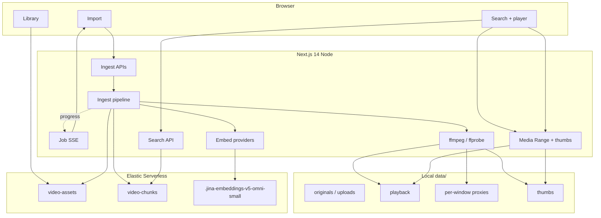

# Architecture

English summary of the running demo. Authoritative decisions and phase
acceptance live in [plan/00-implementation-plan.md](../plan/00-implementation-plan.md).
Chinese companion: [chn.docs/架构与数据流.md](../chn.docs/架构与数据流.md).

**Status:** Phase 11 close-out (2026-08-26). Stack verified through Phase 10 E2E
on Elastic Serverless **9.6.0**.

---

## One-sentence summary

A Next.js 14 + React 18 + EUI demo that windows video with ffmpeg, embeds each
window as **dual-track** visual + audio vectors via pluggable providers (primary:
EIS `jina-embeddings-v5-omni-small`), stores explicit `dense_vector` fields with
timecode and **variant identity** in Elasticsearch, and lets a user find a
moment by text and seek the playback proxy via HTTP Range.

---

## System diagram

---

## Stack (pinned)

| Layer | Choice | Why |
| --- | --- | --- |
| App | Next.js **14.2.35** App Router | Official peer with React 18; Next 15/16 App Router require React 19 |
| UI | React **18.3.1** + EUI **119.1.0** + Borealis **8.0.0** | EUI peers exclude React 19; client-only render (no official SSR) |
| Package manager | **yarn** 1.22.x | Project reproducibility pin |
| Search / store | Elastic Serverless (observed **9.6.0**) | `dense_vector` + RRF + EIS inference |
| Model | `jina-embeddings-v5-omni-small`, dims **1024** | No Matryoshka truncation for video |
| Media | Host **ffmpeg / ffprobe** on `PATH` | Not bundled |

No Tailwind. Credentials only in `.env` (gitignored). Media under `data/`
(gitignored).

---

## Core design choices

### Dual-track + RRF (not fused vectors)

Each window produces one visual embedding and one audio embedding. Query-time
fusion uses Elasticsearch **RRF** with explicit `rank_window_size` and modality
weights. A single fused vector (Jina `MergedContentGroup`) was evaluated and
rejected: EIS has no equivalent fusion path, and fusion would destroy the
per-result modality badge.

### Explicit `dense_vector`, not `semantic`

Target cluster is 9.5+ (capable of multimodal `semantic`), but the demo keeps
`dense_vector` for: 9.4 compatibility, no base64 in `_source`, and control of
quantisation / modality labels / RRF. Chunk vectors use `bbq_hnsw` (1024, cosine).

### Variant identity

`variant_id` (16-char hex) hashes chunking preset, provider/model/task/dims,
proxy settings, and `SCHEMA_VERSION`. Standard (64 s / 4 s) and fine (10 s / 2 s)
coexist on one `video_id`. Search and library always filter by `variant_id`.
**Mixing providers inside one variant is prohibited.**

### Per-provider byte budgets

There is no single global video size limit. Operational EIS budget is
**1 048 576** decoded bytes (`EIS_MAX_BINARY_BYTES`), matching Serverless docs.
Phase 2 probe did **not** observe a size-limit 400 up to ~3.1 MB on direct
`_inference/embedding` — see [operations.md](./operations.md). Hosted Jina and
local ceilings remain unmeasured without keys/URL.

### Budget-adaptive visual proxies

Resolution ladder `[1280, 960, 854, 720, 640]` × CRF `[23, 26, 28, 30, 32]`, then
frame reduction `32→24→16`. Goal: keep decoded proxy ≤ provider budget while
preferring quality for the model’s **32-frame** sample. Audio: 16 kHz mono Opus.

### Providers

| Id | Ingest / query path |
| --- | --- |
| `eis` (default) | Passage via `_inference`; query via `query_vector_builder.embedding` |
| `jina` | Hosted API; app-side `query_vector` with `retrieval.query` |
| `local` | Self-hosted URL; same app-side query pattern |

---

## Index roles

| Index | Role |
| --- | --- |
| `video-assets` | One doc per source video; nested variants; job snapshot for SSE hydrate |
| `video-chunks` | One doc per window × variant; dual vectors + timecodes |

Chunk `_id` = `{video_id}_{variant_id}_{chunk_index}` (upsert on re-ingest).
Mappings: [data-model.md](./data-model.md).

---

## Interface surface

Three pages under a shared `AppShell` (fixed header, ZH/EN switch, Chinese
default):

| Route | Purpose |
| --- | --- |
| `/` | Text search, filters, result cards, player seek, timeline strip |
| `/ingest` | URL / local / upload; workload estimate; SSE progress |
| `/library` | Assets + variants; re-index (retry); remove (ES only) |

Layout intent: [ui-mockup.md](./ui-mockup.md). HTTP contracts:
[api-contract.md](./api-contract.md).

---

## Out of scope (NFR-8)

Multi-user auth, durable job queue, crash auto-resume (manual idempotent retry
only), production multi-tenant hardening, containerised ffmpeg image.

---

## Related docs

| Doc | Content |
| --- | --- |
| [data-flow.md](./data-flow.md) | Ingest + search sequences |
| [operations.md](./operations.md) | Measured spike / probe / E2E numbers |
| [api-contract.md](./api-contract.md) | Job machine, SSE, REST |
| [reviews/e2e-verification-2026-08-26.md](../reviews/e2e-verification-2026-08-26.md) | Phase 10 Tiffany trailer results |
| [reviews/self-review-2026-08-26.md](../reviews/self-review-2026-08-26.md) | Known limits after close-out |
