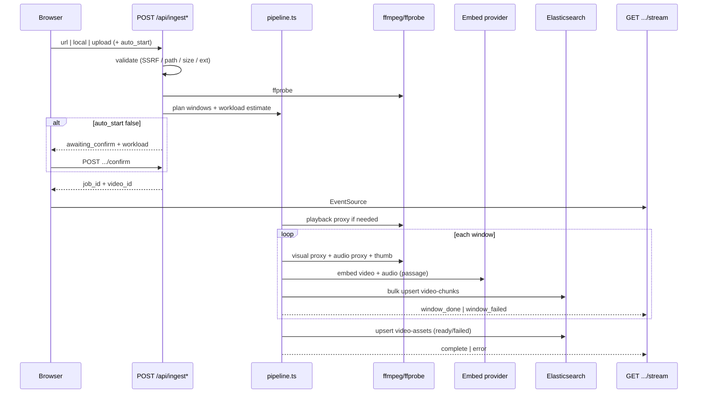
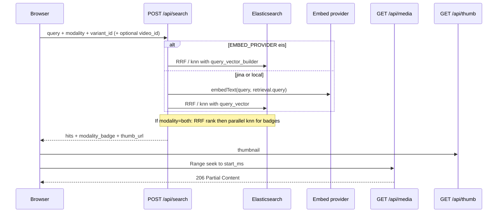

# Data flow

Ingestion and search sequences as implemented. Normative request/response shapes:
[api-contract.md](./api-contract.md). Architecture overview:
[architecture.md](./architecture.md).

---

## Ingest flow

### Steps (detail)

1. **Mode select** — `url` | `local` | `upload` on `/ingest`.
2. **Validation**
   - URL: scheme, no embedded credentials, SSRF (private/loopback), **per-hop
     redirect re-check**, connect to resolved IP while preserving Host/TLS name,
     streaming byte cap, timeout; partial files quarantined.
   - Local: absolute path, `realpath` under `LOCAL_IMPORT_ROOT` (required env).
   - Upload: extension allowlist, stream to `data/uploads/`.
3. **Provenance (FR-22)** — sanitized `source_origin_path` + one-way
   `source_fingerprint`; raw secret-bearing URLs never stored or echoed.
4. **Probe** — duration, geometry, fps, codecs, `has_audio`.
5. **Variant + estimate** — derive `variant_id`; plan windows; return workload
   (`windows`, `inference_calls`). If `auto_start: false`, stop at
   `awaiting_confirm` until confirm.
6. **Pipeline** (async after accept)
   - Playback proxy (720p H.264 faststart when source taller than config max).
   - Per window: budget-adaptive visual proxy (≤ provider decoded-byte budget),
     16 kHz mono Opus audio, mid-frame JPEG thumb (~320 px).
   - Dual-track embed (passage task / EIS ingest path).
   - Bulk upsert chunks; update asset nested variant + job fields.
7. **Progress** — SSE events (`snapshot`, `estimate`, `progress`, `window_*`,
   `complete` / `error`, `heartbeat`). On `complete`,
   `throughput_windows_per_min` is set.
8. **Failure policy** — per-window failures do not stop siblings; fatal or
   zero successful windows → `failed`. **No crash auto-resume**; recovery is
   idempotent `POST /api/jobs/{id}/retry` (new `job_id`, same chunk `_id`s).

### Disk layout (under `MEDIA_ROOT`, default `./data`)

| Dir | Contents |
| --- | --- |
| `uploads/` | Incoming upload / probe / e2e artifacts |
| `originals/` | Canonical source copies |
| `playback/` | Seekable playback files |
| `proxies/` | Per-window embed inputs |
| `thumbs/` | Per-window JPEGs |

All under `data/` are gitignored except `.gitkeep` placeholders.

### Observed throughput (Phase 10, Tiffany ~157.5 s)

| Preset | Windows | Ingest elapsed | Throughput |
| --- | --- | --- | --- |
| standard (64 s / 4 s) | 3 | ~40.1 s | ~5.1 win/min |
| fine (10 s / 2 s) | 20 | ~65.2 s | ~19.9 win/min |

Source: [reviews/e2e-verification-2026-08-26.md](../reviews/archive/2026-09-10-file-video-search/e2e-verification-2026-08-26.md).

---

## Search + play flow

### Retrieval rules

- **Pre-filter** every knn branch on `variant_id` (required); optional `video_id`.
- **Modality**
  - `visual` / `audio` — single knn (`badge_strategy: single_knn`)
  - `both` — weighted RRF over visual + audio knn, then parallel knn windows to
    attribute `modality_badge` (`visual` | `audio` | `both`)
- **Window sizing** — `SEARCH_RANK_WINDOW_SIZE` (default 50), raised to `≥ size`.
- **Click-to-play** — player `currentTime = start_ms / 1000` against
  `/api/media/{videoId}` with HTTP Range (FR-18). Timeline strip lists windows
  for the active `video_id` + `variant_id`.

### Observed search latency (Phase 10)

Same-corpus fixture queries: **~62–196 ms** wall per query (EIS
`query_vector_builder`), well under the warm p95 &lt; 2 s target. Phase 8 smoke
on a 1-chunk corpus: **~200 ms**. See [operations.md](./operations.md).

---

## Library maintenance

| Action | API | Effect |
| --- | --- | --- |
| List | `GET /api/library` | Assets + ready `variant_ids` |
| Re-index | `POST /api/jobs/{job_id}/retry` | New job; upsert same chunk ids |
| Remove | `DELETE /api/library/{videoId}` | Deletes ES asset + chunks; **files kept** on disk |
