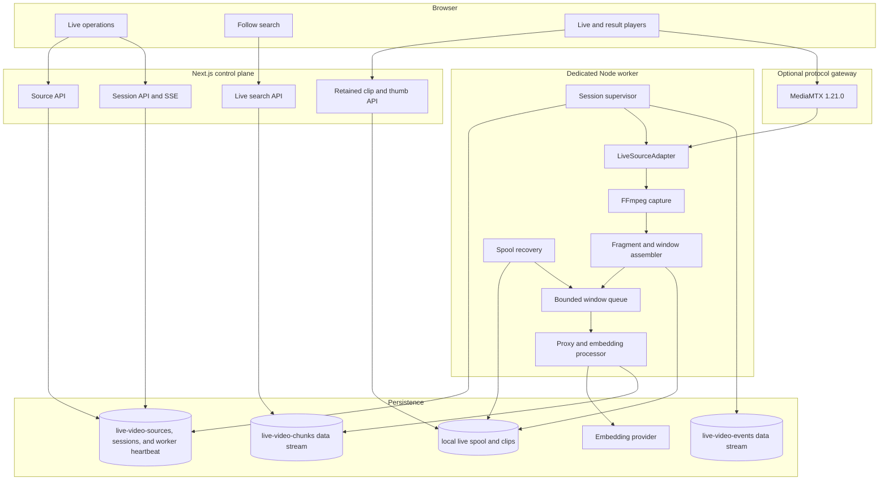
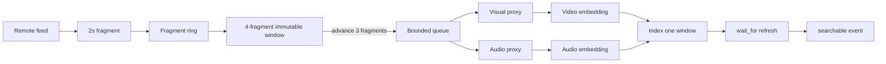
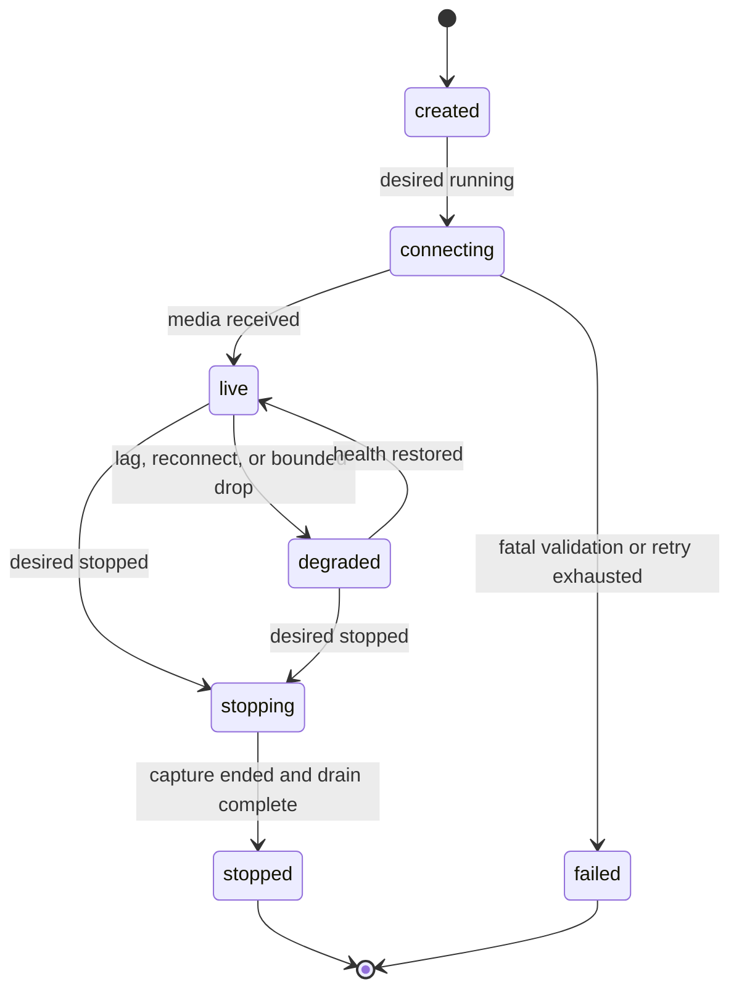

# Live Video Search Architecture

Status: **planned, not implemented**  
Canonical decisions:
[`ARCHITECTURE-SPINE.md`](../plan/architecture/architecture-live-video-search-2026-09-10/ARCHITECTURE-SPINE.md)

## Outcome

Add continuous remote-feed indexing and live search without coupling an
unbounded media process to Next.js or changing the completed-file pipeline.
RTSP over TCP is the MVP source protocol. The same source port later accepts HLS
and SRT adapters; WHIP/WebRTC publishing terminates at MediaMTX.

## Component view



## Why a dedicated worker

The current file pipeline can run asynchronously after an API request because
each job is finite. A live source is unbounded, must reconnect, and must recover
after application restarts. The worker therefore runs as a separate process or
Compose service and owns all FFmpeg children. Next.js only changes desired
state, reads persisted observed state, serves retained media, and performs
search.

The worker and web process coordinate through Elasticsearch control documents,
not shared in-memory maps. This keeps the first deployment dependency-light and
allows a later queue service without changing API contracts.
The worker also writes a singleton heartbeat/capability document. The API rejects
new session commands when that heartbeat is stale, but never writes observed
session state on the worker's behalf.

## Source adapters

```ts
type LiveProtocol = 'rtsp' | 'hls' | 'srt';

interface LiveSourceAdapter {
  readonly protocol: LiveProtocol;
  resolve(snapshot: LiveSourceSnapshot): Promise<ValidatedConnectDescriptor>;
  buildFfmpegInput(
    source: ValidatedConnectDescriptor,
    inputScriptPath: string,
  ): readonly string[];
  protocolPolicy(): { outerScheme: string; nestedProtocols: readonly string[] };
  classifyFragment(meta: FragmentProbe): FragmentMetadata | Discontinuity;
  classifyExit(exit: FfmpegExit): 'retryable' | 'fatal' | 'stopped';
}
```

The adapter returns arguments, never a shell command. Authentication is
resolved inside the worker from `connection_ref`; sanitized endpoints returned
to the app contain no userinfo, passphrase, or signed query parameters. The API
stores a pending source without resolving the secret. The worker resolves a
structured environment secret with a base URL that contains no userinfo plus
separate adapter credentials, validates it, and stores safe provenance. A
session snapshots that reference, source revision, and validated endpoint
fingerprint; reconnect resolves the same snapshot and must match its fingerprint
after repeating DNS and destination checks.
RTSP uses an exact nested-protocol whitelist. HLS redirect / playlist /
segment / encryption-key destinations are revalidated against the same allow
policy before FFmpeg opens the playlist. SRT caller/listener admission uses
environment-backed passphrase plus `LIVE_SRT_PEER_ALLOWLIST` for listener mode.
WHIP terminates at MediaMTX; the worker consumes an internal RTSP path and never
speaks WebRTC signaling. All three extensions are **opt-in** via
`LIVE_ALLOWED_PROTOCOLS` (default remains `rtsp` only).

### Delivery order

1. **RTSP/TCP** — direct worker pull and required E2E path (Phases 1–9).
2. **HLS/LL-HLS** — remote playlist pull with redirect/key revalidation (Phase 10).
3. **SRT** — caller/listener with FFmpeg capability gate; listener requires
   `LIVE_SRT_PEER_ALLOWLIST` as a fail-closed ops gate (real connected-peer
   admission belongs to MediaMTX/firewall) (Phase 10).
4. **WHIP/WebRTC** — browser publishes to MediaMTX; worker consumes internal RTSP
   (Phase 10 adapter + locked-down example gateway profile; remote-network soak still open).

FFmpeg documents protocol whitelisting and RTSP TCP transport. WHIP is IETF RFC
9725. These choices are recorded in
[`live-video-operations.md`](./live-video-operations.md#verified-technology-baseline).

## Window pipeline

### Canonical media contract

- Select the first usable video stream and first usable audio stream; attached
  pictures and data/subtitle tracks are ignored.
- Fragment container is MPEG-TS. Video is H.264/yuv420p, capped at 1280x720 and
  25 fps, with forced keyframes at the configured 2-second target. Optional
  audio is AAC-LC, mono, 16 kHz. The exact FFmpeg arguments are one tested
  constant owned by the RTSP adapter, not assembled from user input.
- The worker probes every finalized fragment. A codec, resolution, selected
  track-set, or time-base change is a media-signature discontinuity and opens a
  new epoch.
- Only groups of four consecutive finalized fragments are embedded. Their actual
  PTS coverage is recorded and may differ slightly from the 8-second target.
  Epoch tails with fewer than four fragments receive a terminal, manifest-only
  `window_incomplete` record.
- A finalized standalone MP4 is the sole immutable object used for embedding
  replay and retained result playback; index acknowledgment changes its replay
  state but not its retention deadline.



Capture produces canonical MPEG-TS fragments with H.264 video, optional AAC
audio, and keyframes forced at a 2-second target. Actual fragment duration may
vary, so the fragment-aligned assembler groups four consecutive finalized
fragments and advances three while recording actual PTS boundaries. Each window
is finalized as a standalone MP4 for inference and retained playback. A reconnect, worker restart,
media-signature change, or timestamp discontinuity closes the epoch and records
any incomplete tail explicitly.

Video and audio embedding for the same window run concurrently. Different
windows use `LIVE_PROCESSING_CONCURRENCY`, initially 2, in addition to the
global provider gate and worker queue limits. Index visibility waits have a
separate bounded in-flight batch limit. Raising concurrency above 2 requires new
one-stream capacity evidence.
Video proxy, video embedding, and thumbnail are required. Audio absence
is valid; when audio is present its proxy and embedding are required. Any
required branch failure after bounded retries terminally fails the window and
no partial document is indexed.

## State ownership



- API: sole writer of `desired_state` and operator annotations.
- Worker: sole writer of `observed_state`, reserved/published revisions, epoch, counters, lag, and
  runtime errors.
- Elasticsearch: durable coordination and read model.
- Spool manifest: authority for finalized media awaiting acknowledgment.
- Live chunk data stream: immutable searchable windows.
- Live event data stream: session history, per-window searchable acknowledgment,
  SSE replay, and follow-search cursor authority.

The event path is a recoverable outbox. Before a chunk is indexed, the manifest
records a generic `event_intent` and the worker reserves its revision. After
`refresh=wait_for`, the worker persists the completed event with final timing,
creates or verifies it, and only then appends terminal `index_ack`. The complete
crash matrix is in
[`live-video-state-recovery.md`](./live-video-state-recovery.md).

One nonterminal session is allowed per source. Creating again is idempotent;
`force_new` drains the old session before a new ID is allocated. The local MVP
worker is a single process guarded by an exclusive lock in the spool root. A
distributed lease without a fencing token is explicitly not used.

## Search behavior

The existing search implementation should be refactored into an index-agnostic
query core rather than copied. File routes keep their current index and filters;
live routes add source/session/time filters and use `live-video-chunks`.

Follow search creates a short-lived process-local query handle containing the
normalized request, query-vector fingerprint, cached vector, one revision cursor
per session, and expiry. Durable `searchable` events rerun only Elasticsearch
retrieval. Live EIS search calls `/_inference` once per cache miss and supplies
the resulting `query_vector` to every kNN/RRF branch; it does not use the current
file route's repeated `query_vector_builder` calls. The web process discovers
events by polling Elasticsearch at `LIVE_EVENT_POLL_MS`; there is no in-memory
worker-to-web event channel. Web restart expires the handle; the client recreates
it and receives fresh cursors.

## Playback behavior

- **Current live view:** gateway HLS/WebRTC URL when MediaMTX is enabled.
- **Search result:** immutable retained short clip and thumbnail from the spool.

This separation makes old results inspectable after disconnect and prevents
player behavior from becoming part of embedding correctness.

## Backpressure and failure policy

Capture must not create an unbounded backlog. Work queue, indexing-ack queue,
in-flight batches, replay-protected input, retained playback media, and manifest
headroom have separate limits. Warning
moves the session to `degraded`. At a hard work limit the MVP first persists a
terminal record, then drops the oldest queued, non-processing window by
epoch/sequence. If even the reserved manifest headroom is unavailable, capture
stops and the session fails. Every gap remains visible in counters and events.

Retry categories:

| Category | Action |
| --- | --- |
| Connection timeout/reset | reconnect with capped exponential backoff; new epoch after media resumes |
| Invalid destination/credentials | fatal until operator changes configuration |
| Provider 429/503 | live-specific bounded attempts/backoff within the per-window deadline; queues remain observable |
| Invalid media window | record window failure; continue epoch when decoder remains healthy |
| Worker restart | scan manifest; replay finalized unacknowledged windows |
| Duplicate document create | acknowledge only after immutable-fingerprint verification |

## Deployment seed

Docker Compose gains independent `web`, `live-worker`, and optional `mediamtx`
services. `web` and `live-worker` share the configured spool volume and Elastic
credentials from the repository `.env`, but Compose maps variables explicitly
per service instead of attaching the full file to both. Only
`live-worker` receives stream credential variables, and web startup rejects any
`LIVE_SOURCE_*` secret. The deterministic fixture uses a separate FFmpeg-capable
publisher service because the MediaMTX image does not contain FFmpeg. MediaMTX
ports are exposed only when a protocol requires them.

Production scaling is deferred. If the accepted target exceeds one concurrent
stream, fenced session ownership and a durable queue become a separate
architecture update rather than implicit changes to this design.
