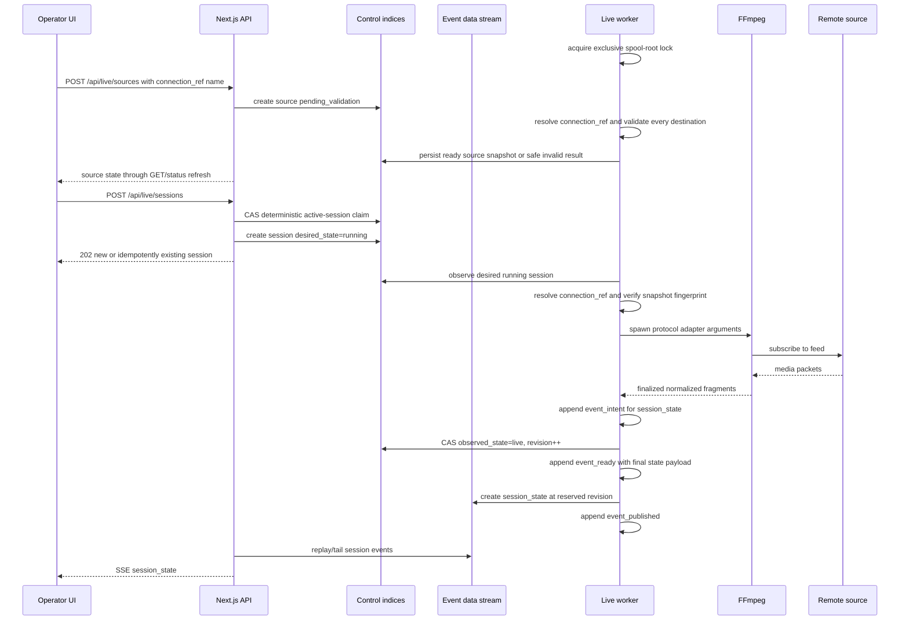
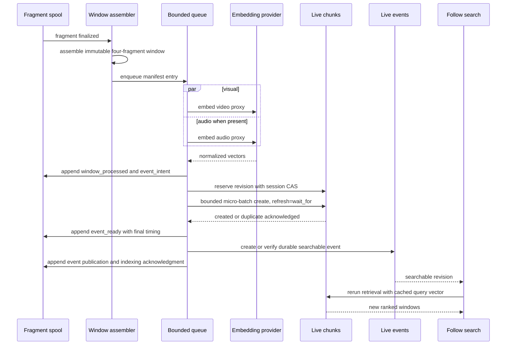

# Live Video Data Flow

Status: **planned, not implemented**

## Start and capture



## Window to searchable document



## Disconnect and recovery

```mermaid
sequenceDiagram
  participant R as Remote source
  participant F as FFmpeg
  participant W as Live worker
  participant S as Spool manifest
  participant ES as Elasticsearch

  R--xF: disconnect
  F-->>W: retryable exit
  W->>ES: reserve degraded revision and state
  W->>W: close epoch; record incomplete fragment/window
  W->>F: reconnect with capped backoff
  F-->>W: media resumes
  W->>S: append epoch_started with clock anchor
  W->>ES: stream_epoch++, state=live, revision++
  Note over W,S: after worker restart
  W->>S: scan every nonterminal window and event intent
  W->>ES: create or fingerprint-verify window documents
  W->>ES: create or fingerprint-verify reserved events
  W->>S: append terminal acknowledgment
```

## Stop

1. API sets `desired_state=stopped`.
2. Worker changes observed state to `stopping` and stops accepting new media.
3. Open fragment is finalized if valid or recorded incomplete.
4. Queue drains until `LIVE_STOP_DRAIN_TIMEOUT_MS`.
5. At timeout, processing work remains recoverable; queued work is either
   retained for recovery or durably dropped according to the configured limit.
   FFmpeg exits.
6. Worker persists final counters and `observed_state=stopped`.

## Time semantics

- RTSP MVP creates a `receive_anchor` from the first finalized HLS playlist
  entry in each epoch. Its `PROGRAM-DATE-TIME` and first fragment PTS are paired
  with worker UTC and monotonic time sampled when finalization is observed; the
  measured spread is persisted as uncertainty.
- `window_start_at` / `window_end_at`: anchor UTC plus source-PTS delta. These
  are approximate receive-timeline event times, not asserted camera wall time.
- `@timestamp`: `window_end_at`, making the data stream time-oriented.
- `event_ingested`: Elasticsearch request time.
- `searchable_at`: observed after refresh acknowledgment.
- `capture_lag_ms`: monotonic `window_closed - window_end_receive`; this uses a
  separately sampled receive instant rather than subtracting unrelated clocks.
- `processing_lag_ms`: same-boot monotonic `searchable - window_closed`.
- Cross-boot processing lag: conservative UTC difference plus recorded
  uncertainty, marked `cross_boot`; monotonic clocks are never compared across
  worker boots.
- `start_offset_ms` / `end_offset_ms`: relative to the current session epoch,
  not to an indefinite source lifetime.
- `stream_epoch`: starts at 1 and increments on reconnect, worker restart,
  media-signature change, or timestamp/clock discontinuity.

Absolute timestamps are the primary live-search filter. Relative offsets exist
for clip playback and diagnostics only.
