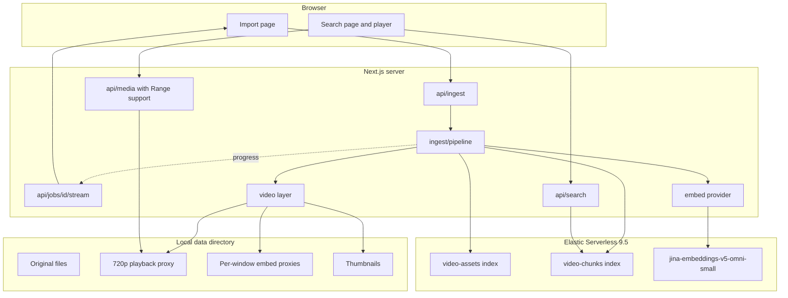
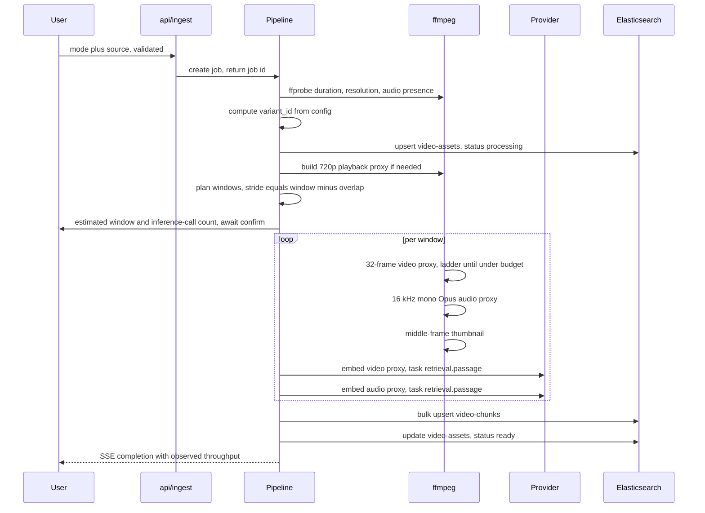

# Implementation Plan

**This is the single consolidated plan for the project.** It supersedes and
absorbs every earlier plan fragment, including the plan previously kept in
Cursor's own plan storage outside this repository. If any other plan document
disagrees with this file, this file wins.

Target: a demo website that indexes video with `jina-embeddings-v5-omni-small`,
stores per-window dense vectors with timecode metadata in Elastic Serverless
(9.5), and lets a user find a moment by text and play from it.

Requirements this plan implements:
[requirements/01-interpreted-requirements.md](../requirements/01-interpreted-requirements.md).

Offline copies of the Elastic, Jina, EUI, and arXiv sources that justify the
design live in [reference/](../reference/) — start with
[reference/00-index.md](../reference/00-index.md) and
[reference/constraints-cheat-sheet.md](../reference/constraints-cheat-sheet.md).

Task tracking: [todo/00-todo.md](../todo/00-todo.md).

## Decisions on record

Every one of these was chosen by the user or forced by a verified constraint.
They are listed together so the rationale is not scattered through the document.

- **Backend**: Elastic Serverless, search profile, credentials via `.env`.
  Stack version **9.5**.
- **Embedding path**: pluggable providers (`eis`, `jina`, `local`). The primary
  path is **decided by measurement, not up front** — Phase 2 measures the real
  binary ceiling on the EIS direct `_inference` path before the choice is made.
- **Chunk vector structure**: **dual-track** — one visual vector and one audio
  vector per window, fused at query time with RRF. A single fused vector per
  chunk was evaluated and rejected; see "Fusion: evaluated and not adopted".
- **Storage**: explicit `dense_vector` fields, not the `semantic` field type.
  Reasoned decision, see "Version matrix".
- **Chunking**: 64 s window with 4 s overlap as the requested default, plus a
  10 s / 2 s fine preset for comparison. Both coexist via variant identity.
- **UI**: **EUI** (Elastic UI) as the design system, rendered client-side only.
  Tailwind removed. Stack pinned to **Next.js 14.2.35 + React 18.3.1 + EUI
  119.1.0** (see "Interface stack" and Round-4 correction). yarn is a project
  pin for reproducibility.
- **UI languages**: bilingual Chinese and English, Chinese default.
- **Repository**: Git initialised on `main`. Reviews are new dated files, never
  rewrites of an artifact something else responds to.

## Verified constraints

These are measured or quoted, not assumed. Each drives a design choice.

### Binary input limits, per provider

There is no single global limit. Carrying one value was the mistake in the
earlier draft of this plan.

- **EIS on Serverless: 1 MB, fixed.** Each non-text value has a default maximum
  decoded size of 1 MB; the `indices.inference.max_binary_input_size` cluster
  setting can raise it to 20 MB on self-managed and Cloud Hosted, but "In
  Elasticsearch Serverless, the limit is fixed at 1 MB"
  ([elastic-semantic-field-reference.md](../reference/elastic-semantic-field-reference.md),
  line 123). Oversized values are rejected with HTTP 400.
- **Hosted Jina API: unknown, unmeasured.** The live specification at
  `https://api.jina.ai/openapi.json` (fetched 2026-08-25, HTTP 200) defines
  `VideoDoc` and `AudioDoc` with a single property each — "Video/Audio as a URL
  or base64-encoded string" — and states **no** size or duration constraint. The
  documented file-size limits are 5 MB for images and 8 MB for PDFs only. Any
  figure for video is a guess until Phase 2 measures it.
- **Local self-hosted server: a configurable reference baseline.** `jina-airgap`
  defaults to `MAX_MEDIA_BYTES = 10 * 1024 * 1024`. That is a source constant,
  not a service contract, and must not be quoted as the hosted limit. Treat
  local as a measured, configurable 10 MB baseline — not an unconstrained
  quality baseline — until the effective cap is validated (and changed, if
  needed).
- **No official source states 75 MB or 20 MB for Jina video.** The 20 MB figure
  belongs to the Elastic cluster setting above.

One ambiguity remains and is resolved by measurement: the 1 MB limit is
documented on the `semantic` field page, while this project calls
`_inference/embedding/` directly. Whether both pass through the same gate is
**OQ1**, settled by the Phase 2 probe.

### Version matrix, and why `dense_vector` rather than `semantic`

From [elastic-inference-service.md](../reference/elastic-inference-service.md),
lines 99-104:

- **9.3+** — can create endpoints and run multimodal `embedding` inference;
  cannot use these models with `semantic_text`.
- **9.4+** — `semantic_text` mappings work, for **text-only** embeddings.
- **9.5+** — the `semantic` field type supports **all** modalities.

The target is 9.5, so a `semantic`-field design is now possible. It is still
rejected, for three reasons:

1. it pins the project to 9.5, whereas `dense_vector` also runs on 9.4;
2. `semantic` retains the full base64 data URL in `_source`, inflating the index
   by orders of magnitude;
3. it gives up direct control of quantisation, per-modality labelling, and RRF
   weighting.

The omni models themselves are Generally Available from **9.4** in regions US,
SG, EU, and APJ
([elastic-eis-supported-models.md](../reference/elastic-eis-supported-models.md),
lines 77-78). Elastic's own docs are internally inconsistent about 9.3 versus
9.4 here, so the probe trusts the live endpoint over any version table.

### Task adapters are pinned, and cross-provider mixing is prohibited

- Hosted Jina exposes `task` with enum `retrieval.query`, `retrieval.passage`,
  `text-matching`, `clustering`, `classification`, and **`"default":
  "text-matching"`**. Leaving it unset silently yields a text-matching adapter
  instead of a retrieval one, with no error.
- The EIS `embedding` endpoint for omni documents no `task` or `input_type` in
  any captured Elastic reference; only `text_embedding` endpoints show
  `input_type: ingest`
  ([elastic-jina-models-nlp.md](../reference/elastic-jina-models-nlp.md),
  lines 202, 232-244). Stated precisely: **no captured reference documents one**,
  which is not the same as proving none exists. Phase 2 therefore attempts to
  pass task settings and records whether they are accepted, rejected, or
  silently ignored (**OQ3**).

Consequence: model ID, task, dimensions, and normalization ownership are pinned
per provider and recorded on every variant. **Mixing providers within one
variant is prohibited by default.** L2 normalisation makes magnitudes
comparable; it does not make two provider stacks the same embedding function.

One partially mitigating fact, and the reason the compatibility test must not
stop at text: the model card states omni **text** vectors are bit-identical to
`jina-embeddings-v5-text-small`, which suggests strong cross-stack determinism
for text. It says nothing about video and audio preprocessing parity, which is
precisely what this project depends on. A text-only comparison would therefore
pass while telling us nothing useful, which is why the Phase 4 fixture covers
all three modalities.

### Dimensions stay at 1024 — no Matryoshka truncation

Jina supports truncation from 1024 down to 32 dimensions, but the technical
report shows video is by far the most truncation-sensitive modality: the video
curve "diverges from the others well before 64 dimensions and crosses below half
its full-dimension score around 32"
([arxiv-jina-embeddings-v5-omni.md](../reference/arxiv-jina-embeddings-v5-omni.md),
line 1032). Do not shrink vectors to save space.

### Model behaviour

- At most **32 frames** are sampled from any video input, evenly spaced.
- Video resolution is normalised like images: below 262,144 pixels (512x512
  equivalent) it is upscaled, above 3,072,000 pixels downscaled, then tiled into
  28x28 patches, with every two frames producing one token set.
- Audio is cut into 30 s segments, resampled to 16 kHz, tokenised at one token
  per 40 ms.
- Responses carry per-modality token counts (`image_tokens`, `audio_tokens`,
  `video_tokens`), which is what makes the pre-import workload estimate
  (NFR-10) possible.
- `normalized` defaults to `true` on the hosted API.

### Fusion: evaluated and not adopted

The live Jina specification includes `MergedContentGroup`: "Mixed-modality
chunks fused into ONE embedding per group. The executor sends every chunk to the
model in a single forward pass ... Order within `content` is semantically
meaningful." That would give one vector per chunk covering picture and speech
together.

Elastic has no equivalent. Non-text input is a single `{type, value}` object;
"Each non-text value is processed as a single unit and produces one embedding";
an array produces one embedding per array position; and at query time
Elasticsearch "uses the best matching embedding to score the top-level
document" — N values, N vectors, max-pooled, never fused
([elastic-semantic-field-reference.md](../reference/elastic-semantic-field-reference.md),
lines 90-161).

Dual-track plus RRF is therefore the design: it works on every provider and it
preserves the per-result modality badge, which a fused vector would destroy.

### EUI constraints

Verified in
[elastic-eui-constraints.md](../reference/elastic-eui-constraints.md):

- EUI 119.1.0 declares `react: "^17.0 || ^18.0"` — **no React 19**. The React 19
  epic was closed without widening the range and a related defect is still open.
- `elastic/next-eui-starter` is **archived**; its README states "The lack of SSR
  support also currently makes Next.js a challenge with EUI", and the tracking
  issue elastic/eui#7630 is still open.
- **Next.js React requirements (official upgrade guides, not peer ranges):**
  - Next.js **14.2.x**: peers `react: ^18.2.0` only.
  - Next.js **15**: "The minimum versions of `react` and `react-dom` is now 19."
  - Next.js **16** App Router: "uses the latest React Canary release, which
    includes the newly released React 19.2 features."
  Peer ranges on Next 15/16 that still list `^18.2.0` are **not** an App Router
  + React 18 support statement (Round-4 finding P0-2).
- **yarn** is this project's pinned package manager for reproducibility. EUI
  docs historically recommend yarn; that is a project choice, not proof that
  npm cannot consume EUI.
- EUI styles with Emotion and ships Borealis design tokens, which conflict with
  Tailwind's preflight.

## Stack

- **Next.js 14.2.35** (App Router) with TypeScript — only Next major whose
  declared React peer is React 18-only, matching EUI
- **React 18.3.1** / **react-dom 18.3.1**, `@types/react` / `@types/react-dom`
  18.3.x
- **EUI 119.1.0** plus `@elastic/eui-theme-borealis` **8.0.0** (exact peer),
  `@emotion/react` 11.x, `@emotion/css` 11.x, `moment`, `@elastic/datemath`
- **yarn** as the pinned package manager
- No Tailwind
- `@elastic/elasticsearch` official client
- ffmpeg and ffprobe invoked as child processes, no wrapper library, so the
  budget-adaptive encoder controls flags precisely
- zod for configuration and API payload validation
- Server-Sent Events for ingestion progress; no external queue or broker

Already verified on this machine: Node v22.13.1, ffmpeg 8.1.1 with libx264,
libopus, libsvtav1, videotoolbox.

## Interface stack

EUI is used as the real component library, not merely as a visual reference,
because hand-reproducing Borealis spacing, typography, and form controls is more
work than adopting the library and drifts from it over time.

EUI renders **client-side only**. The application is an internal demo with no
SEO or first-paint SSR requirement, so EUI's documented lack of SSR support
costs nothing here, while the Next.js server continues to host the parts that
genuinely need a server — ffmpeg, Elasticsearch, SSE, Range streaming, uploads —
none of which import EUI.

**Phase 1 first gate:** a disposable compatibility spike with the exact pinned
versions must render `EuiProvider` plus one interactive EUI control through the
App Router, pass both `yarn dev` and `yarn build && yarn start`, and fail on
peer warnings promoted to errors, hydration errors, duplicate React, Emotion
insertion errors, or runtime failures. Record the resolved tree and result in
`docs/operations.md` before full scaffolding is treated as done.

Concretely:

- a thin server shell in the root layout;
- `EuiProvider` inside a component marked `'use client'`;
- `@emotion/cache` with Next's `useServerInsertedHTML` to inject styles and
  avoid a flash of unstyled content;
- fallback if that proves unstable: wrap EUI-heavy pages in
  `dynamic(() => import(...), { ssr: false })`;
- API routes import no EUI, so there is no SSR conflict on the server side.

## Architecture



## Ingestion data flow



## Data model

### Variant identity

The earlier `_id` of `{video_id}_{chunk_index}` was defective: both presets
number from zero, so ingesting the fine preset after the standard preset
overwrote the overlapping IDs and orphaned the rest, producing a mixed and
invalid chunk set.

A **`variant_id`** is derived by hashing chunking configuration, provider, model,
task, proxy encoder settings, and a `schema_version`. Document `_id` becomes:

```
{video_id}_{variant_id}_{chunk_index}
```

Keeping several variants in one index is safe because the `knn` `filter` is a
**pre-filter**, "applied during the approximate kNN search to ensure that
`num_candidates` matching documents are returned"
([elastic-knn-query.md](../reference/elastic-knn-query.md), line 147). Without
that property this would have required an index per variant.

Re-ingesting a variant replaces that variant only. Creating a different variant
never touches an existing one. Variant selection is threaded through search, the
library page, the player timeline, and the Phase 10 comparison.

### Index `video-assets`, one document per video

- Identity: `video_id` keyword, `title` text with keyword subfield
- Provenance: `source_mode` keyword (url, local, upload); `source_origin_path`
  keyword not indexed (sanitized origin+path only — no userinfo, no secret
  query/fragment); `source_fingerprint` keyword (one-way hash of the raw
  submitted ref); `media_path` keyword not indexed. Never persist or return
  the raw submitted URL unless an explicit allowlist marks it safe (FR-22).
- Media facts: `duration_ms` long, `width` and `height` integer, `fps` float,
  `has_audio` boolean, `size_bytes` long, `container` and `video_codec` keyword
- Variants: nested list, each with `variant_id`, chunking settings, provider,
  model, task, dims, normalization owner, proxy settings, `schema_version`,
  chunk count, and per-variant status
- State: `status` keyword, `job` object per the state machine, `error` text,
  `created_at` date

### Index `video-chunks`, one document per window per variant

- Identity and variant: `video_id`, `variant_id`, `chunk_index`
- Locating metadata, which is what makes click-to-play work: `start_ms`,
  `end_ms`, `duration_ms`, `start_label` and `end_label` as `mm:ss` keywords for
  direct display
- Vectors: `embedding_video` and `embedding_audio`, each `dense_vector`,
  `dims: 1024`, `similarity: cosine`, `index_options.type: bbq_hnsw`, queried
  with `rescore_vector.oversample` to recover the accuracy quantisation costs
- Embedding provenance: `provider`, `model`, `task`, `normalized_by`
- Proxy provenance: `video_proxy` object with `bytes`, `width`, `height`,
  `frames`, `crf`, `strategy`, `ladder_exhausted`; `audio_proxy` object with
  `bytes`, `bitrate`, `codec`; `thumb_path`; `has_audio`
- Denormalised for display without a join: `video_title`, `source_mode`,
  `created_at`

Both vectors are L2-normalised before indexing, which makes cosine and dot
product equivalent. This does **not** make vectors from different providers
interchangeable — see the task-adapter constraint above.

## The core technical piece: budget-adaptive proxy encoding

This is where the project either works or does not, so it gets its own section.

Given a window `[start, end)` and a byte budget `B` from the measured
per-provider value:

**Visual proxy.** Extract exactly `N` frames (default 32) evenly spaced across
the window, then encode them as a low-frame-rate H.264 MP4. Because the model
samples 32 frames from whatever it is given, a 4-second file containing 32 good
frames is the preferred encoding hypothesis over a 64-second file containing 32
degraded ones at the same size — validate by retrieval quality, not by asserting
dominance.

Walk the resolution ladder outer, CRF ladder inner, stopping at the first
combination at or below `B`:

- resolutions: 1280x720, 960x540, 854x480, **720x405 (meaningful floor)**,
  then 640x360 **as a last-resort rung for byte compliance only**
- CRF: 23, 26, 28, 30, 32

720x405 is about 291,000 pixels, just above the model's 262,144-pixel upscaling
threshold; below it the model upscales anyway, so shrinking loses detail while
saving no tokens. 640x360 is retained purely so a window can still be indexed
rather than dropped, and its use is flagged in chunk metadata.

**Terminal behaviour.** If 640x360 at CRF 32 still exceeds `B`, the encoder does
not loop forever and does not silently skip. It reduces the effective frame
count in defined steps (32, 24, 16), and if the budget is still unmet it records
`ladder_exhausted: true`, fails that window with a specific error code, and lets
the job continue with the remaining windows. The failure surfaces in the UI
rather than being swallowed.

**Audio proxy.** `-vn -ac 1 -ar 16000 -c:a libopus -b:a 16k` over the same time
range. The model resamples to 16 kHz mono regardless, so this discards almost
nothing beyond Opus compression. A 64-second window lands near 128 KB, well
inside even the 1 MB budget. Skipped entirely when `has_audio` is false.

**Thumbnail.** Middle frame of the window, 320 px wide JPEG, written to
`data/thumbs/`.

**Playback proxy.** Separate concern from embedding. Transcode to 720p H.264
with `-movflags +faststart` when the source exceeds 720p or uses a codec
browsers handle poorly; otherwise serve the original untouched.

## Window planning

```
stride = window_ms - overlap_ms          // default 64000 - 4000 = 60000
starts = [0, stride, 2*stride, ...] while start < duration_ms
end    = min(start + window_ms, duration_ms)
```

A trailing window shorter than `CHUNK_MIN_MS` (default 4000) is merged into its
predecessor. Implemented as a pure function in `lib/video/plan-chunks.ts` so it
can be unit tested without touching ffmpeg.

Presets: `standard` at 64 s / 4 s (the requested default) and `fine` at
10 s / 2 s for comparison. Each is its own variant.

## Retrieval

A text query is fused across both modalities with an RRF retriever over two
`knn` child retrievers, one per vector field. Because each window is its own
document, no deduplication or collapsing is needed.

Three facts from
[elastic-rrf-retriever.md](../reference/elastic-rrf-retriever.md) and
[elastic-knn-retriever.md](../reference/elastic-knn-retriever.md) shape this:

- **Per-retriever `weight` is supported** (`ga 9.2`), so the visual and audio
  branches can be weighted asymmetrically instead of treated as equals. The
  modality control maps onto this directly: "visual only" and "audio only" drop
  a child retriever, "both" keeps two with configurable weights.
- **`rank_window_size` defaults to only 10** and must be `>= size`. It is set
  explicitly; leaving the default would quietly cap fusion quality.
- **RRF returns a fused rank score only.** Nothing in the response identifies
  which child retriever produced a hit, so the promised modality badge needs its
  own mechanism.

Query-vector generation is provider-dependent, and `query_vector` and
`query_vector_builder` cannot be combined:

- **EIS**: let Elasticsearch build the vector via
  `query_vector_builder.embedding` with an explicit `inference_id`, since the
  target is a `dense_vector` field rather than a `semantic` field. Elastic's own
  example confirms this shape.
- **Jina or local**: compute the vector in the application with
  `task: retrieval.query`, normalise it, pass it as `query_vector`.

Variant selection is a `filter` on `variant_id`, which is a pre-filter and
therefore safe.

### Search response contract

Belongs in `docs/api-contract.md`, written before Phase 8. The open design
choice, to be settled there:

1. issue the two `knn` retrievers as separate searches and fuse in the
   application, yielding per-modality rank and score at the cost of an extra
   round trip; or
2. run RRF for ranking, then a cheap second lookup to recover per-modality
   similarity for the returned chunk IDs only.

Either way the contract must define the label for a chunk returned by **both**
branches — badge "both", or badge the higher-scoring modality — and must be
tested with a chunk that both branches retrieve.

UI controls: modality toggle (visual, audio, both), variant selector, optional
filter to a single video, adjustable top-k.

## Providers

Three implementations behind one interface, selected by `EMBED_PROVIDER`. Each
pins model, task, dimensions, and normalization ownership, and records them on
the variant. Cross-provider variants are prohibited by default.

**`eis`.** `POST _inference/embedding/{inference_id}` on the Serverless project.
Only Elasticsearch credentials needed, and the query side can push vector
generation into Elasticsearch. The endpoint is **discovered or created** rather
than assumed; if creation is required it is documented before being applied, per
NFR-6. Byte budget is whatever Phase 2 measures.

**`jina`.** `POST https://api.jina.ai/v1/embeddings` with `JINA_API_KEY`. `task`
must be set explicitly — `retrieval.passage` for documents, `retrieval.query`
for queries — because the API default is `text-matching`. Video and audio byte
budget is unknown until measured.

**`local`.** A self-hosted omni server exposing an OpenAI-compatible
`/v1/embeddings` accepting base64 video and audio. The `jina-airgap` reference
server defaults to `MAX_MEDIA_BYTES = 10 MB` in its own source — a **configurable
10 MB baseline**, not an unconstrained service. Do not treat local as a
budget-free quality baseline until that cap is measured and, if raised,
re-validated. The `jina_repo/jina-airgap` checkout on this machine lists the
model in `models/catalog.json`: 1.74B parameters, 1024 dimensions, 32K context,
roughly 8 GB memory, MLX-capable. Weights are not downloaded yet; only the
catalog is present.

Why the third option is worth wiring even though it is not the default: a
higher measured or reconfigured local cap makes it a strong place to calibrate
the encoder ladder and to estimate how much retrieval quality the Serverless
1 MB budget costs; inference is free, so pipeline iteration burns no tokens.
Caveats: CC-BY-NC-4.0 weights, so demo use only, and CPU inference on a 1.74B
model with 32-frame video input will be materially slower than hosted services.

Shared behaviour: L2 normalisation where the provider does not already
guarantee it, exponential backoff with jitter on HTTP 429 and 503, a concurrency
gate honouring `EMBED_CONCURRENCY`, and per-modality token accounting.

## File layout

```
app/
  layout.tsx                     thin server shell
  providers.tsx                  'use client' EuiProvider + Emotion cache
  page.tsx                       search and playback
  ingest/page.tsx                three-mode import form with live progress
  library/page.tsx               indexed videos, variants, status
  api/ingest/route.ts            create job from url or local path
  api/ingest/upload/route.ts     streaming multipart receiver
  api/jobs/[id]/stream/route.ts  SSE progress
  api/search/route.ts            RRF dual-modality retrieval
  api/media/[videoId]/route.ts   Range-capable streaming, enables seeking
  api/thumb/[chunkId]/route.ts   thumbnail serving
lib/
  config.ts                      zod-validated environment
  es/client.ts, indices.ts, search.ts, index-chunks.ts
  embed/provider.ts, eis.ts, jina.ts, local.ts, retry.ts
  video/probe.ts, plan-chunks.ts, proxy-encode.ts, thumbnail.ts, playback.ts
  ingest/sources.ts, pipeline.ts, job-store.ts, variant.ts
  i18n/zh.ts, en.ts
scripts/
  probe-capabilities.ts          run this first, see Phase 2
  setup-indices.ts
data/                            gitignored: originals, proxies, thumbs, uploads
```

## UI sketch

Built from EUI components; this is layout intent, not literal markup.

```
+---------------------------------------------------------------+
|  Jina Omni Video Search        [visual|audio|both]  ZH/EN     |
+---------------------------------------------------------------+
|  [ a cat on a windowsill                          ] [ Search ]|
|  video: [ all v ]  variant: [ standard v ]  top-k: [ 20 --o- ]|
+-------------------------------+-------------------------------+
|  RESULTS                      |  PLAYER                       |
|  +-------+ trailer.mp4        |  +-------------------------+  |
|  | thumb | 01:04 - 02:08      |  |                         |  |
|  +-------+ 0.163  [visual]    |  |      <video>            |  |
|  +-------+ trailer.mp4        |  |                         |  |
|  | thumb | 00:00 - 01:04      |  +-------------------------+  |
|  +-------+ 0.124  [audio]     |  |xx|  |xxx|      |x|   |     |
|                               |  timeline, matches marked     |
+-------------------------------+-------------------------------+
```

Clicking a result card sets the player source and seeks to `start_ms`. The
timeline strip below the player marks every matching window in the current
video for the selected variant.

## Configuration

| Variable | Default | Purpose |
| --- | --- | --- |
| `ELASTICSEARCH_URL` | none | Serverless endpoint, required |
| `ELASTICSEARCH_API_KEY` | none | required |
| `ES_INDEX_ASSETS` | `video-assets` | |
| `ES_INDEX_CHUNKS` | `video-chunks` | |
| `EMBED_PROVIDER` | `eis` | `eis`, `jina`, or `local` |
| `EMBED_INFERENCE_ID` | none | required; discovered or created, not assumed |
| `EMBED_MODEL` | `jina-embeddings-v5-omni-small` | pinned on the variant |
| `EMBED_TASK_PASSAGE` | `retrieval.passage` | documents |
| `EMBED_TASK_QUERY` | `retrieval.query` | queries |
| `EMBED_DIMS` | `1024` | never truncated, see Matryoshka note |
| `EIS_MAX_BINARY_BYTES` | none | **set from EIS probe**; decoded media bytes |
| `JINA_MAX_BINARY_BYTES` | none | **set from hosted Jina probe**; same byte layer |
| `LOCAL_MAX_BINARY_BYTES` | none | **set from local probe**; same byte layer |
| `EMBED_BUDGET_BYTE_LAYER` | `decoded_media` | `decoded_media`, `base64_string`, or `json_request` — must match how the probe measured |
| `EMBED_VIDEO_FRAMES` | `32` | matches the model's sampling |
| `EMBED_MAX_LONG_EDGE` | `1280` | top of the resolution ladder |
| `EMBED_CONCURRENCY` | `3` | parallel inference calls |
| `JINA_API_KEY` | none | only when provider is `jina` |
| `LOCAL_EMBED_URL` | none | only when provider is `local` |
| `CHUNK_PRESET` | `standard` | `standard` or `fine` |
| `CHUNK_WINDOW_MS` | `64000` | |
| `CHUNK_OVERLAP_MS` | `4000` | |
| `CHUNK_MIN_MS` | `4000` | |
| `SEARCH_RANK_WINDOW_SIZE` | `50` | RRF default of 10 is too small |
| `SEARCH_RANK_CONSTANT` | `60` | RRF default |
| `SEARCH_WEIGHT_VIDEO` | `1.0` | per-retriever RRF weight |
| `SEARCH_WEIGHT_AUDIO` | `1.0` | per-retriever RRF weight |
| `MEDIA_ROOT` | `./data` | |
| `LOCAL_IMPORT_ROOT` | none | sandbox for local-path import; reports "not configured" cleanly |
| `MAX_SOURCE_BYTES` | `2147483648` | |
| `PLAYBACK_MAX_HEIGHT` | `720` | |
| `DEFAULT_LOCALE` | `zh` | |
| `SCHEMA_VERSION` | `1` | part of `variant_id` |

`.gitignore` excludes `.env` and `data/`. Only `.env.example` is committed.

## Phases

Every phase has an acceptance criterion in
[todo/00-todo.md](../todo/00-todo.md), so "done" is verifiable rather than a
matter of opinion.

**Phase 1, scaffolding.** Compatibility spike first (exact pinned versions:
Next.js 14.2.35, React 18.3.1, EUI 119.1.0), then full app scaffolding with
TypeScript, EUI client-side provider and Emotion cache, `.gitignore` **before
any `.env` or `data/`**, `.env.example`, zod-validated `lib/config.ts`, the
`data/` subdirectory structure, and a README covering prerequisites (Node 22,
ffmpeg 8 on `PATH`, **yarn**) and startup. The README lands here rather than at
the end, because a project that cannot be started by reading its own README is
not really scaffolded. Git is already initialised; the documentation baseline
commit already exists.

**Phase 2, capability probe.** Build and run `scripts/probe-capabilities.ts`
before writing the pipeline. It must, **per provider**:

- discover or create the `embedding` endpoint and report its ID, task type,
  model, dimensions, and version availability;
- measure the real binary ceiling with progressively larger clips, including a
  boundary above 1 MB for non-EIS providers, and record the exact payload size
  that first returns HTTP 400 (resolves **OQ1**, **OQ2**);
- attempt to pass task settings and record accepted, rejected, or silently
  ignored (resolves **OQ3**);
- exercise the **query side** via `query_vector_builder`, not only the ingest
  path;
- record per-modality latency and token usage.

Findings go into `docs/operations.md`, and the measured budgets are written per
provider rather than as one global value.

**Phase 3, Elasticsearch layer.** Mappings including `variant_id`, and an
idempotent `scripts/setup-indices.ts`. Per NFR-6, `docs/data-model.md` is
written **before** the script runs against the live instance.

**Phase 4, embedding providers.** `provider.ts` interface plus `eis.ts`,
`jina.ts`, and `local.ts`, with task pinning, L2 normalisation, backoff on 429
and 503, a concurrency gate, and per-modality token accounting. Only `eis.ts` is
needed to proceed.

**Phase 5, ffmpeg layer.** Probe, window planning with unit tests, the
budget-adaptive visual encoder including its terminal behaviour, the audio proxy
encoder, thumbnails, and the playback proxy.

**Phase 6, import modes.** All three sources with the hardened validation: SSRF
protection extended through redirects and per-hop re-validation, connection to
the validated address while preserving Host and TLS name, stream-time byte
enforcement, request and idle timeouts, partial-file quarantine, and `realpath`
containment for local paths. `docs/api-contract.md` and the job state machine
are written before this phase.

**Phase 7, pipeline and progress.** Job orchestration against the documented
state machine, SSE streaming, idempotent bulk upsert, the pre-import cost
estimate, and observed throughput on completion. Restart recovery is **out of
scope**; the guarantee is idempotent manual retry.

**Phase 8, retrieval API.** RRF dual-modality search with explicit
`rank_window_size`, per-retriever weights, variant and video filters,
provider-aware query vector generation, and the documented response contract
including the modality badge rule.

**Phase 9, interface.** Import page, library page with variants, search page,
player with timeline, bilingual strings, all built from EUI components rendered
client-side.

**Phase 10, end-to-end verification.** Ingest the public-domain 1961 *Breakfast
at Tiffany's* trailer (158 s) from the Internet Archive. Run both the standard
and fine presets as separate variants and compare them **on our own corpus with
a time-range relevance and top-k success metric**. Do not compare against
Elastic's published scores: they split the same trailer into 28 PySceneDetect
scenes of 1.9 to 18.4 seconds, so raw scores over different candidate sets are
not comparable. Record results in `reviews/`.

**Phase 11, documentation close-out.** Complete the `docs/` set: every
**empirical** claim traces to a recorded measurement; externally defined
constants (dimensions, protocol limits, defaults) trace to a cited source.
Refresh the README, mark `todo/` complete, and write a self-review in
`reviews/` covering known limits: picture quality under the measured byte
budget, temporal precision of 64-second windows, the client-only EUI rendering
decision, and the `embedding` query vector builder's status.

## Deployment target

Single developer machine, macOS on Apple Silicon, started with `yarn dev` or
`yarn build && yarn start`. ffmpeg and ffprobe are host dependencies resolved
from `PATH` rather than bundled, which is the one thing needing attention if
this is ever containerised: the image must carry ffmpeg. Nothing else in the
stack is outside the package manager. Multi-user access, authentication, and a
durable job queue are explicitly out of scope and bounded by NFR-8.

## Risks

- **The probe may confirm a 1 MB hard cap on direct inference calls.** Then
  visual proxies land on a lower ladder rung and retrieval quality drops. Three
  mitigations in increasing order of effort: switch `EMBED_PROVIDER` to `jina`,
  whose video budget is unmeasured but plausibly larger; shorten the window so
  fewer frames each carry more pixels; or stand up the `local` provider, where
  the cap is a source constant. The `local` path also gives a budget-free
  baseline for measuring what the cap costs.
- **EUI and Next.js are an officially unsupported combination for SSR.**
  Mitigated by rendering EUI client-side only and by the `dynamic` import
  fallback. The residual risk is Emotion style injection edge cases, which
  surface as a flash of unstyled content rather than incorrect behaviour.
- **EUI does not support React 19; Next 15/16 App Router require React 19.**
  Mitigated by pinning **Next.js 14.2.35 + React 18.3.1**, the only combination
  in both declared support ranges. Cost: two Next majors behind; none of the
  missing features are required for this demo. Phase 1 spike gates adoption.
- **The `embedding` query vector builder is newer surface area.** Mitigated by
  plain `dense_vector` fields, which are generally available, with a fallback of
  computing query vectors in the application — already required for the `jina`
  and `local` providers, so the code path exists either way.
- **EIS rate limits during bulk ingestion.** Mitigated by the concurrency gate
  and backoff, with token usage logged so throughput can be tuned.
- **Long videos generate many inference calls.** Two per window, so a two-hour
  film at the default window is about 240 calls. Surfaced as a pre-import
  workload estimate before the user commits.
- **Optional and currently blocked**: the `hive-mind` submodule was requested to
  provide Elastic's internal EUI and Next.js integration patterns, but the
  repository is private and the clone failed without credentials. The EUI
  approach above is derived from public sources instead. Revisit if credentials
  become available.

## Revision history

- **2026-08-25, initial plan.** Derived from the original request and three
  rounds of clarification.
- **2026-08-25, revision after the first readiness review.** Added the `local`
  provider, deployment target, scale and latency targets, and per-phase
  acceptance criteria.
- **2026-08-25, consolidation.** Merged every plan fragment, including the
  external Cursor-stored plan, into this single document. Folded in all findings
  from
  [reviews/current-readiness-review-2026-08-25.md](../reviews/current-readiness-review-2026-08-25.md)
  as answered in
  [reviews/review-response-2026-08-25b.md](../reviews/review-response-2026-08-25b.md):
  variant identity, provider isolation and task pinning, per-provider byte
  limits with the hosted Jina figure marked unmeasured, endpoint discovery,
  hardened URL import, corrected acceptance criteria, encoder terminal
  behaviour, and the RRF response contract. Added the version matrix, the
  no-truncation rule for video vectors, the pre-filter justification for
  single-index variants, and the EUI interface stack replacing Tailwind.
- **2026-08-25, Round-4 sync.** Corrected UI stack to Next.js 14.2.35 + React
  18.3.1 after verifying Next 15/16 App Router require React 19. Split per-
  provider budget env vars; fixed local-provider budget wording; sanitized URL
  provenance; softened unproven claims; requirements and `chn.docs` brought
  into sync with this plan. Response:
  [reviews/review-response-2026-08-25-r4.md](../reviews/review-response-2026-08-25-r4.md).
