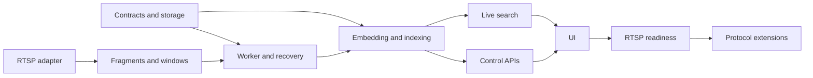

# Live Video Search Implementation Plan

Status: **Phase 10 protocol adapters landed (opt-in; RTSP remains default); remote WHIP soak open**
Date: **2026-09-13**
Branch: **`live-video-search`**

### Confirmed product decisions (2026-09-10 — override prior assumptions)

| Topic | Decision |
| --- | --- |
| Retention | Keep vector metadata, events, and local clip/thumb **forever until explicit delete**. No 7d/8d/24h auto-expiry. DSL must not configure a delete-by-age retention. |
| Spool limits | No fixed GB caps. Default path `./data/live-spool`. Pending/retained media grow until disk is full; `LIVE_*_MAX_BYTES` unset/`0` = unlimited. |
| MVP allowlist | localhost / 127.0.0.1; ports include **554 and 8554**. |
| Scale | Single stream + single worker + single web for MVP (fencing design stays multi-stream-compatible). |
| WHIP | Deferred — RTSP MVP first; do not implement WHIP in Phase 1. |
| Worker image | Separate `node:22-bookworm` + apt `ffmpeg` Dockerfile is OK; Phase 1 may scaffold pin/manifest only. |

This is the implementation sequence for
[`SPEC-live-video-search`](./specs/spec-live-video-search/SPEC.md). Architecture
invariants are binding in
[`ARCHITECTURE-SPINE.md`](./architecture/architecture-live-video-search-2026-09-10/ARCHITECTURE-SPINE.md).
Task status is tracked in [`todo/01-live-video-search-todo.md`](../todo/01-live-video-search-todo.md).

Elasticsearch is never installed or started by this project. All phases use only
the external Elastic instance configured by `ELASTICSEARCH_URL` and
`ELASTICSEARCH_API_KEY` in `.env`; scripts may create only the planned live
indices, templates, data streams, or uniquely prefixed scratch resources there.

## Delivery strategy

Build a vertical RTSP/TCP slice before adding protocols. The first accepted
slice supports one remote source, one worker, 8-second windows with a 2-second
overlap, immediate EIS indexing, live text and image search, and retained result clips. HLS,
SRT, and WHIP are added only through the proven source adapter boundary.

Do not retrofit the unbounded loop into `lib/ingest/pipeline.ts`. Extract its
finite operations—proxy encoding, embedding provider, vector normalization, and
search assembly—into shared functions, but keep file job state and live session
state independent.

## Dependencies and critical path



Phases 1 and 2 can proceed in parallel. The feasibility spike below must pass or
produce accepted plan changes before Phase 3 begins. Protocol extensions do not
block the RTSP MVP acceptance gate.

## Planned source tree

```text
app/
  live/page.tsx
  live/[sessionId]/page.tsx
  api/live/
    sources/route.ts
    sources/[sourceId]/route.ts
    sessions/route.ts
    sessions/[sessionId]/route.ts
    sessions/[sessionId]/start/route.ts
    sessions/[sessionId]/stop/route.ts
    sessions/[sessionId]/events/route.ts
    search/route.ts
    search/image/route.ts
    search/[queryId]/route.ts
    search/[queryId]/events/route.ts
    chunks/[chunkId]/media/route.ts
    chunks/[chunkId]/thumb/route.ts
    sessions/[sessionId]/playback/route.ts
lib/live/
  types.ts
  config.ts
  source-policy.ts
  connection-store.ts
  source-adapter.ts
  adapters/rtsp.ts
  fragment-manifest.ts
  window-assembler.ts
  session-state.ts
  session-repository.ts
  chunk-repository.ts
  event-repository.ts
  queue.ts
  processor.ts
  recovery.ts
  query-cache.ts
  events.ts
worker/
  live-worker.ts
  session-supervisor.ts
scripts/
  setup-live-indices.ts
  live-fixture-publisher.ts
  live-e2e.ts
test/fixtures/live/
  README.md
```

File and module names may change to match code conventions, but module ownership
and dependency direction must remain consistent with the architecture spine.

## Planning prerequisite

Deliverables:

- canonical spec, detailed requirements, architecture spine, implementation
   plan, API contract, data model, state/recovery contract, data flow,
  operations/acceptance plan, and TODO;
- old file-video review artifacts moved intact to a dated archive;
- current README/docs map distinguishes completed file search from planned live
  search.

Acceptance:

- every live capability maps to an owner and an implementation phase;
- assumptions and open questions are explicit;
- archived review filenames remain discoverable and current links resolve;
- no document claims the live feature is implemented or verified;
- the current consolidated review records no unresolved planning blocker.

Feasibility spike before Phase 3:

- run at least 50 windows through MediaMTX, the pinned worker FFmpeg, HLS
  `temp_file` fragments, four-fragment MP4 remux, bounded live proxy preparation,
  concurrent EIS video/audio inference, and a uniquely prefixed scratch data
  stream on the `.env`-configured external Elastic instance with
  `refresh=wait_for`;
- record fragment-duration drift, receive-anchor uncertainty, p50/p95/p99 stage
  timings, backlog, and the exact RTSP timeout/whitelist flags;
- revise the 10-second latency budget, processing concurrency, or queue sizing
  before Phase 3 if evidence does not support the current assumptions.

## Phase 1 — Contracts, configuration, and persistence

Implementation:

1. Add a separate `lib/live/config.ts` schema and `.env.example` placeholders
   without real credentials, including independent work-queue, indexing-ack
   queue, in-flight batch, spool, search-range, request, image-query, and
   heartbeat limits. Do not make live-only values required by file `AppConfig`.
2. Define source/session/worker/chunk/event TypeScript contracts.
3. Pin a dedicated worker image and record Node, FFmpeg build configuration,
   supported protocols/demuxers/encoders, and image digest at startup.
4. Use the installed Elasticsearch 8.19.2 client's typed template, data-stream,
   and lifecycle APIs and prove them against the `.env`-configured external
   Elastic instance. Isolate a raw REST fallback only if that test exposes an
   unsupported call; do not infer compatibility from the Serverless root version.
5. Implement strict source/session/worker mappings and chunk/event data-stream
   templates from
   [`live-video-data-model.md`](../docs/live-video-data-model.md).
6. Add idempotent `setup-live-indices` with read-back verification.
7. Implement repositories with desired/observed ownership, deterministic source
   claims, worker heartbeat, durable events, and optimistic concurrency tests.
8. Extend Vitest discovery to include worker tests.

Acceptance:

- malformed duration, retention, host policy, and queue values fail with the
  exact variable name;
- second setup run is a no-op and read-back matches dimensions, similarity,
  strictness, timestamp field, configured/effective lifecycle, and retention
  source;
- existing file indices are untouched;
- no command installs or starts Elasticsearch locally, and every Elastic call
  targets the `.env`-configured endpoint;
- repository tests prove API/worker fields cannot overwrite each other;
- concurrent creates and interrupted source claims reconcile to one session.

## Phase 2 — Source policy and RTSP adapter

Implementation:

1. Parse source URLs into structured values; prohibit userinfo and unsupported
   schemes.
2. Reuse only the existing IP classification primitives, extending their missing
   multicast, reserved, IPv6 multicast, and NAT64 ranges. Build a new live URL
   parser, host/port allow policy, reconnect resolution, and destination-binding
   path for RTSP.
3. Resolve structured environment-backed credentials only in the worker and
   persist redacted display provenance.
4. Split web and worker environment surfaces before either process starts: only
   the worker receives `LIVE_SOURCE_*`, and web startup rejects those variables.
5. Define the source snapshot, receive-clock anchor, media signature, protocol
   policy, and fragment-output aspects of `LiveSourceAdapter`. Implement RTSP
   over TCP.
6. Add a new spawn-based process supervisor with timeouts, incremental bounded
   stderr classification, graceful
   stop, and capped reconnect backoff.

Acceptance:

- tests reject loopback, metadata, link-local, multicast, protocol smuggling,
  userinfo, invalid ports, DNS changes to forbidden addresses, and raw secrets;
- FFmpeg is spawned without a shell and with an adapter-specific protocol
  whitelist;
- DNS-rebinding coverage proves the validated destination is bound to the
  actual connection through literal-address handling or egress enforcement;
- a local MediaMTX RTSP fixture connects, disconnects, reconnects, and emits
  stable state transitions; it explicitly permits port 8554 and publishes from
  a separate FFmpeg-capable service;
- HLS `program_date_time` plus worker clock sampling produces receive-anchor
  uncertainty no greater than one target fragment.

## Phase 3 — Fragment spool and window assembler

Implementation:

1. Transcode the selected tracks to canonical MPEG-TS fragments with forced
   2-second keyframes through the HLS muxer's `temp_file` publication; treat the
   playlist entry plus renamed file as final, then emit standalone MP4 windows.
2. Append the complete versioned manifest union, including allocation,
   media finalization, processed chunk drafts, generic event intents, event
   publication, acknowledgment, abandonment, failure, incomplete tail, drop,
   and expiry.
   Implement the minimum recovery-critical records first (`epoch_started`,
   allocation, finalization, processed draft, attempt, event intent/readiness/
   publication, acknowledgment, failure, drop, abandonment, and incomplete
   tail). Expiry, recovery-audit records, and compaction may follow in Phase 4
   without changing the schema version; this is an optional sequencing choice,
   not a reduced final contract.
3. Implement the pure fragment-aligned assembler: four consecutive fragments,
   advance three, record actual PTS coverage, and never cross an epoch.
4. Create opaque clip/thumb refs rooted inside a validated session spool.
5. Implement spool usage accounting and retention interfaces.

Acceptance:

- pure fixtures prove exact boundaries, overlap, no duplicate sequence, short
  tail behavior, 2.03-second fragment drift, PTS reset, codec change, and
  reconnect epoch handling;
- killing capture during a write never exposes a partial finalized fragment;
- manifest reduction deterministically identifies pending, acknowledged,
  failed, incomplete, dropped, and expired windows, including every documented
  crash boundary.

## Phase 4 — Worker, queue, and recovery

Implementation:

1. Create the standalone worker entrypoint and session supervisor.
2. Acquire the process-lifetime spool-root OS lock, publish a worker heartbeat,
   recover every nonterminal manifest, and then poll sessions whose desired
   state is `running`. Refuse to start if another MVP worker owns the lock.
3. Wire capture to bounded work and indexing-ack queues and persist all observed
   state and counters.
4. Implement graceful drain, retry categories, degraded/recovered transitions,
   hard spool limit, and explicit oldest-window drop.
5. On startup, reconcile allocation, publication, generic event intent/readiness,
   event publication, and
   acknowledgment boundaries before accepting new work.

Decision gate before sizing: confirm the simultaneous active-stream target and
local spool capacity. Until then, the one-stream assumptions remain binding.

Acceptance:

- Next.js restart does not stop a worker-owned stream;
- worker restart recovers pending windows and does not duplicate acknowledged
  ones;
- a slow-consumer fixture keeps memory/spool bounded and records every drop;
- a normal-load fixture proves processing service-time p95 <= 4.5 seconds at
  `LIVE_PROCESSING_CONCURRENCY=2` and no growing backlog;
- the slow-consumer fixture includes a sustained provider 429/503 storm and
  verifies deadlines, retry budgets, queue/spool bounds, and explicit drops or
  failures without requiring the normal service-time target during the fault;
- only one worker owns an MVP session at a time.

Verified 2026-09-11: `yarn live-worker` entrypoint; exclusive `.worker.lock`;
heartbeat + capability hash; manifest recovery + claim reconcile before poll;
bounded work/index-ack queues with oldest-drop; live proxy ladder (720 / 3 CRF /
16 frames); processor concurrency/deadline/retries; Compose `live-worker`
service. Unit evidence in `lib/live/*queue|recovery|processor|worker-loop|spool-lock*`.
Phase 5 wires real EIS embed + bulk `refresh=wait_for` through the micro-batcher
(addresses spike close-to-searchable p95 ≈ 12.2s).

## Phase 5 — Live embedding and immediate indexing

Implementation:

1. Refactor the inline finite-window preparation from the file pipeline into a
   shared finite-media function, with a focused file-pipeline regression before
   live callers adopt it. For live windows, use the variant-bound 720 px/three-
   rung proxy profile and run video/audio inference concurrently under the
   existing provider gate with live-specific retries and per-window deadlines.
2. Reserve a generic event intent/revision, then micro-batch immutable live chunk
   creates through a bounded acknowledgment queue and use one
   `refresh=wait_for` per batch.
3. During recovery, query the entire data stream by logical ID before create;
   treat an existing hit or HTTP 409 as acknowledgment only after fingerprint
   verification.
4. Create or fingerprint-verify the durable `searchable` event after confirmed
   visibility, then append terminal acknowledgment. Processing succeeds
   atomically for all available modalities; no partial document is indexed.

Acceptance:

- no-audio, video+audio, provider retry, proxy budget exhaustion, duplicate
  replay, and partial modality failure cases are covered;
- a result is retrievable before its `searchable` event is observed, and every
  crash boundary between intent, visibility, event, and acknowledgment recovers;
- each document's provider, model, task, dimensions, and normalization exactly
  match the selected variant;
- existing file-ingest tests remain green.

Verified 2026-09-11: `lib/media/prepare-finite-media.ts` shared by file
`pipeline.ts` (serial embed) and live (`concurrentEmbed`); `LiveIndexer` +
`createBatch` one refresh per micro-batch; fingerprint verify on 409 / pre-search
by `chunk_id`; searchable event + terminal `index_ack`. Unit evidence in
`lib/media/prepare-finite-media.test.ts` and `lib/live/indexer.test.ts`.

## Phase 6 — Control and event APIs

Implementation:

1. Implement source and session routes from
   [`live-video-api-contract.md`](../docs/live-video-api-contract.md).
2. Persist commands rather than manipulating worker processes from routes.
3. Implement a resumable session SSE stream backed by the durable event data
   stream, with separate reserved/published per-session revisions, retention-expiration responses, gap
   events, snapshots, bounded clients, and heartbeats.
4. Poll durable events at `LIVE_EVENT_POLL_MS`; create events with
   `refresh=wait_for` and keep poll delay outside worker close-to-searchable lag.
5. Standardize stable error codes and safe bilingual UI messages.
6. Add rate and payload limits to mutation endpoints.

Acceptance:

- contract tests cover status codes, idempotency, ownership, sanitization,
  `Last-Event-ID`, stale revisions, and worker-unavailable behavior;
- API responses contain no secret value or absolute path;
- start/stop works after web process restart.

Verified 2026-09-11: live control routes under `app/api/live/**`;
`LiveControlService` for claim/idempotency/worker gate; SSE polls
`live-video-events` at `LIVE_EVENT_POLL_MS`; forever retention means no
age-based cursor expiry (invalid/future cursors still 400). Evidence:
`lib/live/control-service.test.ts`, `errors.test.ts`, `events-poll.test.ts`.

## Phase 7 — Live search and query-vector cache

Implementation:

1. Refactor search assembly to accept a target index/data stream and filter
   builder while preserving current file route behavior.
2. Require `variant_id` and add live source, session, and bounded time filters to
   text and image search.
3. Implement a bounded TTL/LRU query-vector cache keyed by provider identity,
   role, normalized query or image checksum, and dimensions.
4. For live EIS search, call `/_inference` once per cache miss and pass the
   resulting `query_vector` into every kNN/RRF branch; do not reuse the current
   three-call `query_vector_builder` path.
5. Implement follow-search handles and SSE streams keyed to each selected
   session's searchable revision; require explicit sessions in follow mode.
6. Anchor process-local cache, handles, and rate limiting on `globalThis` during
   development so route bundles and HMR do not create false expiry behavior.
7. Add retained clip and thumbnail routes with path-traversal, symlink, expiry-
   race protection, and HTTP Range handling.

Acceptance:

- regression fixtures prove byte-compatible file-search response fields;
- one follow query observes new hits while provider query-inference count stays
  one before TTL expiry;
- source/session/time filters are applied inside every knn/RRF branch;
- every live result set is collapsed or deduplicated by `chunk_id` before RRF
  attribution;
- expired media returns 410 without removing the semantic result.

Verified 2026-09-11: `lib/es/search-core.ts` + `executeChunkSearch`; live routes
under `app/api/live/search/**` and `chunks/**`; query cache + follow handles on
`globalThis`; unit suite **161 passed**. End-to-end follow+EIS inference count
gate remains for Phase 9 acceptance run.

## Phase 8 — Live interface and playback

Implementation:

1. Add a bilingual live source and session page that provides registration,
   start, and stop controls and shows state, lag, backlog, counters, and
   sanitized errors.
2. Add live text/image search with follow mode and freshness indicators.
3. Reuse result cards, score display, modality badges, and timeline behavior.
4. Play immutable result clips; optionally display MediaMTX HLS/WebRTC live view.
5. Clearly label the `planned`, `connecting`, `live`, and `degraded` states, and
   identify expired media.

Acceptance:

- browser test covers source creation, start, live progress, follow result,
  clip playback, disconnect/degraded, reconnect/live, and stop;
- UI never claims a window is searchable before the backend event;
- no EUI hydration errors and all controls have accessible labels.

Verified 2026-09-11: bilingual `/live` + `/live/[sessionId]`; shared hit/timeline/
clip/gateway components; `lib/live/ui-state` covers searchable claim + follow
transitions + a11y labels on controls. Full MediaMTX browser E2E deferred to
Phase 9 (no Playwright in repo yet).

Decision gate before the retention UI: confirm vector, clip, thumbnail, session,
and source retention periods. Until then, use the documented assumptions and do
not claim retention compliance.

## Phase 9 — RTSP end-to-end readiness evidence

Implementation:

1. Pin MediaMTX container tag and record digest.
2. Deploy separate web/worker environment surfaces and assert that web startup
   rejects `LIVE_SOURCE_*` secrets.
3. Publish the deterministic fixture from a separate FFmpeg-capable service in
   real time for 10 minutes.
4. Inject one feed disconnect, one worker restart, and one controlled inference
   slowdown.
5. Run text/image queries with expected time ranges and validate retained media.
6. Produce a dated review with run manifest, exact commands, counts,
   percentiles, failures, and PASS/FAIL/NOT RUN gate table.

Acceptance:

- all gates in [`live-video-operations.md`](../docs/live-video-operations.md)
  pass for the current commit;
- initial p95 close-to-searchable latency is 10 seconds or less, and warm-search
  p95 latency is less than 2 seconds;
- no unexplained gaps, duplicate logical hits, cross-epoch windows, unbounded
  backlog, or secret exposure;
- file-video build/tests and selected E2E regression pass;
- the README describes the verified scope without presenting MVP evidence as
  proof of multistream production readiness.

**Status 2026-09-11:** evidence recorded in
[`reviews/live-rtsp-readiness-2026-09-11.md`](../reviews/live-rtsp-readiness-2026-09-11.md)
— **PASS WITH NOTES** (short soak + Playwright NOT RUN). Strict 10-minute
Protocol soak (`READY_DURATION_SEC=600`) remains optional hardening before
calling the Protocol gate fully closed.

## Phase 10 — Protocol extensions

Implementation begins only after the RTSP readiness gate passes:

1. HLS/LL-HLS pull with redirect, playlist, segment, and encryption-key
   destination revalidation.
2. SRT caller/listener modes with peer admission and environment-backed
   passphrase.
3. WHIP publishing through pinned MediaMTX, one-time publishing credentials,
   and internal normalized worker subscription.

Acceptance:

- each adapter passes tests for the shared source contract and protocol-specific
  disconnect, timestamp, authentication, and redaction fixtures;
- SRT is enabled only in a worker image whose capability manifest includes it;
- WHIP has an explicit TLS, CORS, ICE/STUN/TURN, codec, port, and publisher-
  replacement deployment profile plus a remote-network test;
- RTMP(S) remains deferred until a concrete source requires it.

Decision gate before WHIP: confirm first-release scope and which gateway ports
may be exposed in the deployment environment.
