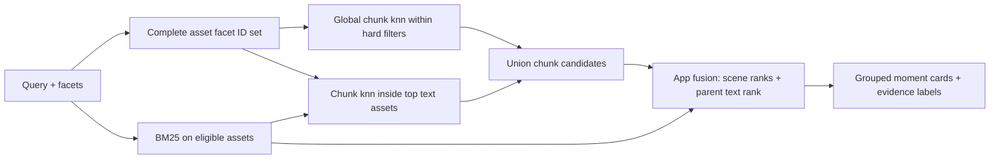

# Plan — Hybrid metadata search for file videos

Status: **revised planning (round 2) — product decisions locked 2026-09-22;
implementation open; numeric defaults provisional pending measured tuning**  
Scope: file-video path (`video-assets` / `video-chunks`). Live sessions stay out of
MVP unless noted.  
Companion todo: [`todo/02-hybrid-metadata-search-todo.md`](../todo/02-hybrid-metadata-search-todo.md).
Reviews addressed: [`round 1`](../reviews/hybrid-metadata-search-plan-review-2026-09-22.md)
(H01–H08) and [`round 2`](../reviews/hybrid-metadata-search-plan-review-r2-2026-09-22.md)
(R1–R4 quantified risks, T-1…T-6 implementation traps).
Elasticsearch mechanics relied on here are collected in
[`reference/elastic-asset-metadata-and-bounded-retrieval.md`](../reference/elastic-asset-metadata-and-bounded-retrieval.md).

---

## Goal

Let operators attach **optional video-level metadata** (description/abstract,
year, actors, type, language, country, …), edit it on already-indexed videos,
and use it to identify candidate videos while visual/audio embeddings select
candidate time windows within them. Return moments, with separate video-level
and window-level evidence. Metadata edits must not re-embed chunks.

---

## Current baseline (what we already have)

| Layer | Today |
| --- | --- |
| Moment search | knn on `embedding_video` / `embedding_audio` (+ RRF when modality=`both`) |
| Filters | `variant_id` (required), optional `video_id` |
| Asset doc | title, media facts, variants, job — **no editorial metadata** |
| UI | Search / Import / Library (remove + batch remove); visual/audio sort and moment grouping already exist |
| Writes / setup | Ingestion replaces whole asset docs; `yarn setup-indices` only creates missing indices |

Metadata belongs on the **asset**. Moments stay on **chunks**. Hybrid must
bridge those two grains.

---

## Recommended product model

### A. Metadata schema (all optional)

Store on `video-assets` under a plain Elasticsearch **`object`** named `meta`
(not the ES `nested` type). All editorial fields are optional. The asset title
remains at the existing root field. Fixed properties must be declared because
the asset mapping uses `dynamic: strict`.

| Field | Type | Role in search | Notes |
| --- | --- | --- | --- |
| `description` / `abstract` | `text` | **lexical** (BM25) | Long description vs short synopsis; no `.keyword` subfield needed |
| `year` | `integer` | **hard filter** (range / term) | Original release/production year, never capture date or setting |
| `actors` | `keyword` array | display only | Canonical display spelling in the operator's locale; never the filter field |
| `actor_ids` | `keyword` array | **hard filter** | Stable person IDs from the person catalog; the only actor facet field |
| `actor_aliases` | `keyword` array | **lexical BM25** | Every known alias of every credited person, all scripts; `copy_to` → `meta.search_text` |
| `actor_keys` | `keyword` array | fuzzy exact match | Server-derived normalization keys per alias (see below) |
| `video_type` | `keyword` | **hard filter** | Controlled vocab (see below) |
| `primary_language` | `keyword` | **hard filter** | BCP-47-ish (`en`, `zh`, `ja`, …) |
| `country` | `keyword` | **hard filter** | One primary production country/region, **ISO-3166-1 alpha-2** (`US`); use the short catalog below |
| `tags` / `tags_key` | `keyword` arrays | display / **hard filter** | No implicit rank boost in MVP; canonical keys are derived server-side |
| `review` | explicit `object` children | provenance | Per editable field: `source` (`manual` or `suggestion`), `confirmed` (boolean), optional `confidence` (0–1) |
| `revision` / `updated_at` | `long` / `date` | concurrency / ops | Revision increments on every metadata save; independent of job progress |
| `search_text` | `text` (index-only) | **lexical BM25** | `copy_to` target for `actor_aliases`; query root `title`, `meta.description`, `meta.abstract`, and this field together. Needs a CJK-safe sub-field (see “Analyzers”) |
| `description_embedding` | `dense_vector` 1024 | **semantic asset channel** | **Phase 3.5, optional.** Embedding of description + abstract; records provider/model/task/dims. Must live on the asset, never in a chunk vector field |

### A1. Person catalog and multilingual actor names

A name is not a string; a person is an entity with an alias set. A Korean
actor legitimately appears as `이정재`, `李政宰`, `Lee Jung-jae`,
`Lee Jungjae`, or `Jung-jae Lee`, and a search may use any of them. Unicode
normalization cannot bridge scripts, so `actors_key`-style normalization alone
(the earlier design) fails every cross-script case.

A curated **person catalog** is the source of truth. For the demo scale it is a
versioned file, `data/people.json`; a `video-people` index is the scale-out:

```jsonc
{
  "person:lee-jung-jae": {
    "display": { "en": "Lee Jung-jae", "zh": "李政宰", "ko": "이정재" },
    "aliases": ["Lee Jung-jae", "Lee Jungjae", "Lee Jeong-jae",
                "이정재", "李政宰"]
  }
}
```

The editor autocompletes from the catalog and stores **IDs**. On save the
server denormalizes the alias set onto the asset, so both filtering and BM25
work in one hop with no join. Alias sets change rarely; when the catalog
changes, a bounded backfill re-expands affected assets. Each of the three
fields does exactly one job:

- **`actor_ids`** — the facet filter. Selecting an actor matches regardless of
  which script the metadata was entered in. This **replaces** `actors_key`,
  which is removed from the design.
- **`actor_aliases` → `meta.search_text`** — BM25 recall for whatever the user
  actually typed.
- **`actor_keys`** — cheap fuzz over typed names, two derived keys per alias:
  *squashed* (`Lee Jung-jae` → `leejungjae`, absorbs spacing and hyphen
  variance) and *sorted-token* (`jae|jung|lee`, absorbs name-order variance).
  They deliberately do **not** compose: `Lee Jungjae` versus `Jung-jae Lee`
  still misses. That is the intended trade — **the curated alias list is the
  primary mechanism and the keys are only cheap fuzz on top.** Do not
  over-engineer normalization to avoid curating aliases.

Normalization for keys: Unicode NFKC → lowercase → strip punctuation and
separators. Applied identically on write and on query.

### A2. Analyzers

The current indices declare no analyzer at all, so everything uses `standard`.
Under UAX#29 that splits Han per character — `李政宰` becomes `[李, 政, 宰]`,
so any asset containing `李` matches — which is a precision collapse, not a
ranking nuance. The UI is bilingual (`DEFAULT_LOCALE` accepts `zh`), so
Chinese queries are expected, not exceptional.

Minimum viable: give `meta.search_text` a `cjk` sub-field using the built-in
`cjk` analyzer (bigrams: `李政宰` → `[李政, 政宰]`) and query both the standard
and CJK fields. **Phase 1 precondition:** probe the target project for the
core analysis plugins, which Elastic documents as bundled on Serverless. If
`nori` (Korean), `smartcn` (Chinese), `icu`, and especially
`analysis-phonetic` are available, prefer them — double-metaphone collapses
`Lee`/`Yi` and `Jung`/`Jeong`, which is precisely the romanization variance
`actor_keys` cannot reach. Record the probe result before freezing the
mapping; analyzer choice cannot be changed later without a reindex.

**Controlled `video_type` (starter set):**  
`trailer` · `movie` · `tv_episode` · `documentary` · `interview` · `news` ·
`sports` · `ugc` · `ad` · `other`.

**Country/region selector (MVP, 20 options):** A deliberately small product
subset of ISO-3166-1 alpha-2 codes, not a claim to cover every production
location. Store only the code and show `code — display name`. Use the same
pinned catalog for metadata validation and the search facet:

| Group | Options |
| --- | --- |
| Selected EU | `DE — Germany`, `FR — France`, `IT — Italy`, `ES — Spain`, `NL — Netherlands`, `PL — Poland`, `SE — Sweden`, `IE — Ireland` |
| East Asia | `CN — China`, `HK — Hong Kong`, `TW — Taiwan`, `KR — South Korea`, `JP — Japan` |
| Selected ASEAN | `SG — Singapore`, `MY — Malaysia`, `ID — Indonesia`, `TH — Thailand`, `VN — Vietnam`, `PH — Philippines` |
| Existing demo example | `US — United States` |

`HK` and `TW` are displayed as region choices; the UI label is **Production
country/region**. The single field records one primary production location.
Missing or out-of-catalog values stay empty; do not guess from the filming
location or story setting. The list may be extended later without changing
stored codes. Code format follows [ISO 3166](https://www.iso.org/iso-3166-country-codes.html);
the selected EU group was checked against the [EU country list](https://european-union.europa.eu/principles-countries-history/eu-countries_en).

`review` has explicit children for `description`, `abstract`, `year`, `actors`,
`video_type`, `primary_language`, `country`, and `tags`, each with the same
fixed properties; it is not a dynamically keyed map. The UI derives source
and confirmation per field, rather than from one global `mixed` flag. A saved
value is confirmed by the reviewer; an unsaved suggestion remains only a
draft. Clearing a field clears its provenance. The server derives key fields
and never accepts client-supplied `search_text`, `actor_ids`, `actor_aliases`,
`actor_keys`, or `tags_key`: actor IDs are resolved against the person catalog
and the alias/key fields are expanded server-side.

Deferred catalog fields: `series`, `episode`, `director`, `studio`,
`content_rating`, `release_date`, `duration_bucket`, multiple production
countries, and metadata embeddings. Add each with a corresponding API/filter
contract when needed.

Editing metadata **must not** change `variant_id` or require re-chunking.

### B. Search strategy (best approach)

Use hard filters for structured facets and an **application-side RRF-style
fusion** for ranked scene and parent-video evidence. Elasticsearch RRF only
fuses the same document IDs; the asset-to-chunk contribution below is our own
explicit projection, not an Elasticsearch cross-index join.



| Signal | Mechanism | When |
| --- | --- | --- |
| Year / actors / type / language / country / tags | **Boolean filter** (must) | Facets selected in UI |
| Description / title / abstract / **actor names** | **BM25** on assets (root `title` + `meta.*` text) | Finds videos and supplies one parent text rank per candidate chunk |
| Visual / audio moments | Existing chunk vector fields, with a separate hybrid execution path | Finds/ranks time windows within both the global and lexical-video paths |

**Why not “RRF everything including year/actors”?**  
Structured facets are categorical. Filtering is precise, cheap, and matches
user intent (“only 1990s · only France”). Putting them into RRF dilutes
relevance and surprises operators. Keep them as **filters**; use RRF only for
**ranked** channels (moment knn ± lexical/semantic text).

**Concrete candidate flow (MVP):**

1. Validate the query, facets, `variant_id`, and optional `video_id`. For a
   hybrid request **or** a request with facets, enumerate **all** matching
   asset IDs within the supported catalog limit; intersect with the explicit
   video ID. Require a nested asset variant with this `variant_id` and
   `status=ready` when enumerating and when selecting text assets. Enumerate
   in **one** request (see §D) — not a paged loop — because this is on the
   critical path before embedding. An empty eligible set returns no hits
   before embedding. With no facets, all ready assets of the selected variant
   remain eligible, including those with no editorial metadata; in that case
   omit the ID filter entirely and keep only `variant_id`. Existing nonhybrid
   requests without facets keep the legacy search path.
2. Embed the text query once, **application-side**, and reuse that vector for
   every kNN branch. The current file path resolves an EIS query through
   `query_vector_builder`, so Elasticsearch runs inference internally and the
   application never sees the vector; the hybrid path must instead use the
   existing `embedTextQueryVector` helper. Because this changes the inference
   route, Phase 3 must first assert that the two paths agree (cosine
   similarity ≈ 1.0 over a sample of queries) — otherwise every "hybrid on/off
   at equal candidate budget" comparison in the acceptance section is
   confounded. Then, for each requested modality, retrieve global chunk
   candidates using the current `variant_id` and eligible IDs only. Use
   `W = min(100, max(50, 10 × requested_size))` as the provisional branch
   window, returning that full candidate window for fusion rather than the
   final `size` hits. Never use BM25 IDs to restrict this global path.
3. Run BM25 on eligible assets. Use a structured `bool.should`, not a flat
   `multi_match`: a `terms` clause on `meta.actor_keys` (highest boost, exact
   normalized alias), a `match_phrase` on `meta.search_text` and its CJK
   sub-field (name precision), and a loose `match` over `title^2`,
   `meta.description`, and `meta.abstract`. A flat `multi_match` defaults to
   `best_fields`, which is wrong here because a name can straddle fields —
   "Audrey" in the title, "Hepburn" in the aliases; if a single `multi_match`
   is kept instead, it must use `cross_fields`. The structured form also
   reports **which** clause fired, which is what the "video metadata matched"
   label needs. Take
   `A = min(20, max(5, ceil(0.2 × eligible_assets)))` ranked assets, and drop
   assets whose BM25 score falls below a configured fraction of the top score.
   A fixed top-20 is wrong on a small catalog: this repository's demo library
   is roughly **36** videos, so a flat 20 would hand the text prior to ~56% of
   the corpus, where "in the top 20" carries almost no information. Retrieve
   at most **5 chunks per asset per modality** from this set, reusing the same
   query embedding, `variant_id`, and the `A`-asset ID list. Prefer **one**
   kNN over that ID set with `k = 5 × A`, then cap per asset in the
   application; a per-asset `msearch` guarantees the budget exactly but costs
   `A` kNN executions per modality, so adopt it only if recall testing shows
   the lexical path is starved. This second path can recover a text-matching
   video absent from global kNN. BM25 returning zero assets does not empty the
   global scene path.
4. Union by `chunk_id` and keep the score for each modality in which the chunk
   was retrieved. Sort each modality's union of *its own* returned hits by its
   comparable same-field kNN `_score` (then `chunk_id`) to assign a pooled
   rank for that modality; never compare per-video ranks directly. This is
   sound because a kNN `_score` under `similarity: cosine` is a pure function
   of the query and document vectors — it does not depend on the corpus or the
   filter — so global-path and lexical-path scores are directly comparable.
   The rank is a **candidate-pool rank, not a true global rank**: a chunk
   absent from the global window normally sorts below it, except when
   approximate `bbq_hnsw` search genuinely missed it, in which case it is
   allowed to sort high. Do not clamp injected candidates to ranks below the
   global window. At most `2 × (W + 5A)` raw candidates enter fusion (≤ 400 at
   the maximum settings); deduplication usually reduces this. Missing channel
   evidence contributes zero.
5. Each candidate gets its parent asset's BM25 rank, if its asset is among
   those `A`. Calculate
   `score_hybrid = Σ_m w_m/(60 + rank_m) + w_text/(60 + rank_asset)` over
   present requested modality ranks `m`, plus at most one text term.
   Provisional weights: visual `1`, audio `1`, **text `0.4`**; visual/audio can
   use the current search weight settings, and a new text weight defaults to
   `0.4`. **`w_text = 1` is not a neutral starting point.** With rank constant
   60, the text term spans `1/61 = 0.0164` (asset rank 1) to `1/80 = 0.0125`
   (asset rank 20), while one modality term spans `1/61 = 0.0164` (rank 1) to
   `1/260 = 0.0038` (rank 200). At weight 1 the text term's entire range sits
   at or above the top of the modality range, so merely appearing in the
   lexical window is worth about as much as being the best visual match in the
   corpus — roughly 50% of the total score for the default single-modality
   `visual` request. `0.4` keeps metadata decisive for name/title queries
   while leaving a strong pure-scene hit able to win; the value is a starting
   hypothesis to be moved by labeled measurement in either direction. Do not
   first fuse visual+audio and then count those ranks again. Sort by hybrid
   score, then best modality rank, asset text rank, and `chunk_id` for stable
   ties. `rank_asset` is deliberately a video-level prior shared by that
   video's candidate windows; it is **not proof** of a match in each window.
6. Apply the existing temporal grouping after ranking. Limit output to the
   requested number of groups. Prefer at most **2 groups per video** while
   other videos can fill the page; relax that provisional diversity limit when
   too few videos are eligible. The response/UI shows scene vector evidence
   separately from a generic “video title/metadata matched” label. Do not
   claim a named person or plot event occurs at the returned timestamp unless
   time-coded evidence exists.

For `modality=audio`, omit chunks without audio vectors; for `both`, missing
audio contributes zero and visual candidates remain valid. A text-only asset
with no ready chunks yields no moment card. Size and window caps are
**provisional engineering limits** for a demo, to be tuned with labeled queries
and latency measurements; they are not empirical quality claims.

**Optional semantic asset channel (Phase 3.5, flagged).** BM25 fails on two
things that matter here: paraphrase ("heist" vs a description saying
"robbery") and cross-language (`时尚` against an English description). The
embedding model is cross-lingual by design — the model card records 93
supported languages and measured `en-ko`, `en-zh`, `ja-ko` pairs — so an
embedding of `description + abstract` fixes both. It adds a third asset-level
rank, `rank_asset_semantic`, projected onto child chunks by the *same*
mechanism as `rank_asset_text`:

`score_hybrid += w_semantic / (60 + rank_asset_semantic)`

The marginal cost is unusually low: index time is one inference per asset on
metadata save (~36 assets), and **query time adds no inference at all**,
because the query vector is already computed app-side for the vector channels.
It is one extra kNN branch over a tiny index.

Two hazards to respect:

1. **Never place `description_embedding` in a chunk vector field or index.**
   The model shares one embedding space across modalities, so a description
   vector is directly comparable to a video-window vector; if they share a
   field a description can win a kNN and be returned as a "moment", breaking
   the moments-only contract. It belongs on the asset document, searched as
   its own branch.
2. **Restate the re-embedding invariant precisely.** The rule is *chunks are
   never re-embedded on a metadata edit*. A description embedding is a new,
   cheap, asset-scoped inference on save, so metadata saves are no longer
   strictly inference-free. It records provider/model/task/dims and is
   invalidated when the provider identity changes, with the same discipline
   as `variant_id`.

Ship it behind `ASSET_SEMANTIC_ENABLED` (default `false`) so BM25-only and
BM25+semantic can be measured independently on the labeled set. Do not assume
it wins; do not defer it to Phase 5 either — the marginal cost does not
justify that.

**Failure behavior:** a failed hard-filter/eligibility lookup fails the
request with a distinct error; never drop a selected filter. If BM25 fails,
return an explicit `text_channel_status=failed` with global vector candidates
only, if that path succeeded. If the vector path fails, fail the request;
metadata text alone cannot yield a verified time-window candidate. Record
each branch's candidate count and duration for diagnosis without exposing
private query text in logs by default.

**Latency budget (provisional targets, to be confirmed by measurement):** the
hybrid path is **four** sequential stages, not "two ES round-trips". Initial
p95 envelope for a demo-scale catalog on the current Serverless project:

| Stage | Requests | Initial p95 target |
| --- | --- | ---: |
| Eligible-asset enumeration + BM25 | 2 (parallelizable to 1 `msearch`) | 300 ms |
| Query embedding (one call, reused) | 1 provider call | 400 ms |
| Global kNN + lexical kNN per modality | 2–4 (one `msearch`) | 700 ms |
| Application fusion, grouping, serialization | 0 | 100 ms |
| **Total end-to-end** | | **1,500 ms** |

Exceeding the total is a tuning signal, not a silent degradation: record each
branch's elapsed time in the response meta. These are engineering budgets for
a demo, not measured results.

### C. Query understanding — one input box, many fields

**Phase 3.5 / 3.6. Not required for the Phase 3 MVP.**

The MVP sends one query string to every channel. That is defensible because
fusion is rank-based: a channel the query does not match simply contributes a
weak rank. But it leaves one real defect.

**The defect.** With query `이정재` the flow embeds a *person's name* and runs
it against `embedding_video`. Those candidates are noise. BM25 still lifts the
correct video, so the right video surfaces — but the windows *within* it were
ordered by a meaningless vector rank, and the UI then shows a precise-looking
timestamp derived from noise. That is the LVR-style honesty problem
(see H07) arriving through a different door. The plan already handles
"text-only asset with no ready chunks"; it does **not** handle "chunks exist
and the vector query is meaningless".

**Target contract.** Parse the single input into a genuine multi-field query.
Every extracted field is optional; the video-embedding channel always runs:

```jsonc
{
  "vector_query": "in a store window",   // residual → always-on vector channel
  "scene_terms_present": true,           // false ⇒ name-/facet-only query
  "free_text": "Audrey Hepburn",         // → BM25 channel
  "extracted": {                         // ALL optional, ALL boosts by default
    "actor_ids":  ["person:audrey-hepburn"],
    "year_from":  1960, "year_to": 1965,
    "country":    ["US"],
    "video_type": ["trailer"]
  },
  "confidence": { "actor_ids": 0.95, "country": 0.4 },
  "parser": "llm" | "dictionary" | "raw"
}
```

**Rule 0 (invariant) — the parser produces query structure and nothing else.
It never participates in retrieval or ranking.**

| Allowed | Forbidden |
| --- | --- |
| Read the user's input string | Read any vector, chunk, asset, or retrieval result |
| Emit `vector_query`, `free_text`, `extracted`, `confidence` | Contribute to scoring, ranking, fusion, or grouping |
| Be skipped entirely with no loss of correctness | Generate, rewrite, summarize, or explain any result text |

Vector retrieval is always performed by the embedding model. The parser only
decides *which span of text* is handed to it. No generative model output ever
reaches a score, a rank, a hit, or a card. This invariant is what keeps the
retrieval path deterministic and reproducible, and it is why an LLM here is a
convenience rather than a dependency: with the parser disabled, the system
degrades to the Phase 3 behavior and remains fully correct.

**Rule 1 — extracted facets are boosts; only user-selected facets filter.**
A facet the operator clicked is a hard filter, unchanged. A facet *inferred*
from typed text has been confirmed by nobody, so it is shown as a removable
chip and applied as a rank boost. Clicking the chip promotes it to a hard
filter. This inverts the risk: a parser error becomes mild ranking noise
instead of an empty result page, and the existing "never silently drop or
broaden a filter" rule still holds. `QUERY_PARSER_FACET_MODE` may be set to
`filter` for evaluation, but `boost` is the product default.

**Rule 2 — the output space is closed, so validation is total.** Every
extracted value is checked against the pinned catalogs (20 countries, 10 video
types, the language list, curated tags, `data/people.json`). Anything
unrecognized is dropped. A parser therefore cannot invent a country code or an
actor who does not exist.

**Rule 3 — three tiers, strictly degrading.** LLM → deterministic catalog
matcher → raw query to all channels. The demo must run correctly with no
parser configured.

#### C1. Deterministic matcher (Phase 3.5, always present)

The entity space is closed and small, so most extraction needs no model:

| Signal | Mechanism | Rough size |
| --- | --- | --- |
| Actor names, any script | Longest-match over the person-catalog alias index | Reuses `data/people.json` |
| `video_type` | Synonym table per locale | ~60 entries |
| `country` | Demonym table (`Korea`/`Korean`/`한국`/`韩国` → `KR`) | ~60 entries |
| `year` | Regex rules (`1990s`, `before 1970`, `60年代`) | ~10 rules |

This is the permanent fallback and is expected to cover the large majority of
demo queries at 100% precision on known entities.

#### C2. Optional LLM parser (Phase 3.6, operator-supplied)

The matcher cannot disambiguate (`Paris` the city, the actor, or the scene),
cannot decide whether `interview` in "Audrey Hepburn interview" is a
`video_type` or a scene term, and cannot generalize to unlisted phrasing
(`韩国电影` is in the table, `南朝鲜的片子` is not). Those are the only jobs
the LLM is being bought for — **disambiguation and generalization, not
extraction**.

**Transport: Elastic Inference Service, called directly.** The parser reuses
the existing Elasticsearch connection rather than introducing a second AI
vendor path. `lib/embed/eis.ts` already issues
`client.transport.request({ path: '/_inference/embedding/<id>' })`; the parser
issues the same shape against a `chat_completion` endpoint. Consequences:

- **No new credential surface.** Same `ELASTICSEARCH_URL` and
  `ELASTICSEARCH_API_KEY`; no parser URL, model name, or API key in app config.
- **The inference endpoint ID is the only knob.** Swapping the model is a
  server-side `PUT _inference/chat_completion/<id>` with no app redeploy and
  no secret rotation.
- **Pinned default: `google-gemini-3.5-flash-lite`** (EIS catalogue, GA). A
  Lite model is the right class for extracting ~6 fields from a short string;
  full Flash is over-specified. Record the resolved model ID in the parse
  evaluation report.

**Why not ES|QL `COMPLETION`.** `ROW q = "…" | COMPLETION parsed = q WITH {…}`
is valid and GA on Serverless, but it is the wrong vehicle here: it requires
task type `completion`, whose input is a single string, whereas calling
`_inference` directly allows **`chat_completion`** with separated system and
user messages and any provider-native structured-output settings. It also
avoids embedding the user's query into an ES|QL statement, avoids the
`esql.command.completion.enabled` cluster setting and its 100-row default
limit, and avoids planner overhead on a one-row synthetic query.
`COMPLETION` is **not** retained for any other purpose in this feature; see
the retrieval invariant below.

**Structured output.** The prompt receives the query, the closed vocabularies
(small enough to inline), and *candidate* actor matches pre-retrieved by the
matcher — never the whole catalog — and must return minimal JSON with no
prose, preferring `null` over a guess. Prompt engineering makes well-formed
output *likely*, not *guaranteed*, so it is never the correctness mechanism:
Rule 2 validation is. **Phase 3.6 verification item:** determine whether EIS
passes provider-native structured output (Gemini `responseSchema` / JSON mime
type) through `task_settings`. If it does, use it; if not, prompt plus
validation plus a single repair retry.

| Variable | Default | Purpose |
| --- | --- | --- |
| `QUERY_PARSER_PROVIDER` | `dictionary` | `none` \| `dictionary` \| `eis` |
| `QUERY_PARSER_INFERENCE_ID` | none | EIS `chat_completion` endpoint ID (e.g. one backed by `google-gemini-3.5-flash-lite`) |
| `QUERY_PARSER_TIMEOUT_MS` | `800` | Hard deadline; on expiry fall back to `dictionary`. **Must be set explicitly** — the Serverless inference default is 120 s |
| `QUERY_PARSER_MAX_TOKENS` | `256` | Output ceiling; the schema is small |
| `QUERY_PARSER_FACET_MODE` | `boost` | `boost` \| `filter` (evaluation only) |
| `QUERY_PARSER_CACHE_TTL_MS` | `300000` | Parse-result cache |
| `QUERY_PARSER_CACHE_MAX` | `128` | Parse-result cache entries |

Setting `QUERY_PARSER_PROVIDER=eis` without `QUERY_PARSER_INFERENCE_ID` fails
startup validation with the offending variable name, matching the existing
`EMBED_PROVIDER` pattern. Availability must be checked at runtime rather than
inferred from a version number — Serverless version reporting is documented as
non-indicative — so Phase 3.6 begins by creating the endpoint and calling it
once.

**Latency.** Parsing is a *serial* stage — the residual determines what to
embed — so it does not fit the 1,500 ms envelope unmitigated. Three
mitigations, all required:

1. **Cache the parse.** Mirror `lib/live/query-cache.ts`, which is already a
   `globalThis`-anchored TTL+LRU built for exactly this shape.
2. **Skip the model when there is nothing to disambiguate.** No catalog hit at
   all, or a single unambiguous full-string alias match, goes straight to the
   vector path. The LLM should be off the critical path for most queries.
3. **Speculative parallel embed.** Issue `embed(full_query)` and
   `parse(query)` concurrently. When the residual equals the full query — the
   common case — the vector is already warm; otherwise re-embed. This trades
   an occasional extra inference for the serial hop. Both calls now target the
   same service, which makes this trivial to wire.

Measured baseline for sizing: EIS text embedding round-trips in ~157 ms in
this repository's own compatibility report. A completion producing ~150 tokens
will be materially slower — budget **400–900 ms** and confirm by measurement.

Two further constraints:

- **Region.** Every Gemini entry in the EIS catalogue is US-only, so a
  non-US Serverless project adds a cross-region hop, and the query text leaves
  for a US region. Where that is unacceptable, the multi-region alternatives in
  the catalogue are larger models; record the choice rather than defaulting
  silently.
- **Concurrency.** The parser must **not** share the `EMBED_CONCURRENCY` gate.
  That gate is sized for ingest window embedding; queueing an interactive parse
  behind a batch of window inferences would defeat the whole latency design.

#### C3. Empty-residual behavior (required, Phase 3)

When parsing yields no scene terms, the vector channel still runs — it is the
one non-optional channel — but `scene_terms_present=false` reduces its rank
weight, the card is labelled *"matched on video metadata"*, and the UI must
not present the timestamp as evidence of the named person or event. Ranking
windows by similarity to a bare name is dishonest, and this is the concrete
rule that prevents it. This behavior is required in Phase 3 even before any
parser exists, because a user can always type only a name.

#### C4. Evaluation

The parser needs its own labeled set, ~50 `query → expected structure` pairs,
separate from and much cheaper than the relevance set. The metric that governs
is **over-trigger rate**, not accuracy: a missed facet is a mild ranking loss,
a wrongly applied one is a zero-result page. Under Rule 1 that asymmetry
largely disappears, which is exactly why Rule 1 comes first. Report
dictionary-only versus dictionary+LLM on the same set before enabling the LLM
by default anywhere.

---

### D. Denormalize or join?

| Option | Pros | Cons |
| --- | --- | --- |
| **A — Join at query time** (filter assets → `video_id` terms on chunks) | Single edit source; no chunk rewrite | Multiple ES requests for facets, BM25, and bounded chunk expansion; large allow-lists |
| **B — Denormalize facets onto chunks** | One knn pre-filter | Metadata edit must update many chunks |

**MVP: Option A.** A dedicated asset-ID query returns up to **10,000** eligible
IDs in a **single** request. `index.max_result_window` defaults to 10,000,
which is exactly this cap, so paging is not required and must not be used on
the interactive path — a 500-per-page loop would cost up to 20 sequential
round trips before embedding even starts. The asset `_id` **is** the
`video_id` (`upsertAsset` indexes with `id: doc.video_id`), so no field fetch
is needed:

```json
POST /video-assets/_search
{
  "size": 10000,
  "_source": false,
  "track_total_hits": 10001,
  "query": { "bool": { "filter": [ /* facets + nested ready variant */ ] } }
}
```

`track_total_hits: 10001` yields `total.relation: "gte"` when more than 10,000
match — an exact, cheap overflow signal. On overflow return
`FILTER_SCOPE_TOO_LARGE` (422) without silently truncating or dropping
filters. Do not reuse the Library list limit (100/500) or a top-`A` BM25
result as the hard-filter set. Query size, array lengths, and total expansion
work are bounded at the API. Keep point-in-time + `search_after` in reserve
only if the cap is ever raised above 10,000 — at which point Option B should
be re-evaluated anyway.

Two costs to measure before freezing the 10,000 cap: the request body itself
(10,000 UUIDs ≈ 380 KB of JSON on every global kNN branch), and kNN
filtering, where the `filter` is a pre-filter applied during approximate graph
search — a large or highly selective filter can degrade `bbq_hnsw` traversal
or force exact search. If measured catalog size or latency outgrows this
design, evaluate Option B for cheap facets; keep descriptions on assets.

---

## Auto-enrichment (what can be automatic)

| Field | Automatic? | Approach | Confidence |
| --- | --- | --- | --- |
| `description` / `abstract` | Later opt-in | A separately configured caption/ASR provider, with sample-based provenance | Unknown until provider/evaluation are chosen |
| `primary_language` | Limited local suggestion | Prefer explicit media language tags, if present; never infer language from an absent track | Tag is a clue, not a verified transcript |
| `year` | Limited local suggestion | Unambiguous filename/title year pattern only; do not guess from visuals | Low |
| `video_type` | Later opt-in | A separately configured classifier over title/description/frames | Unknown until provider/evaluation are chosen |
| `actors` / `country` | Manual for MVP | Do not infer cast or production country from faces/scenery | N/A |
| `tags` | Later opt-in | Extract from confirmed description or provider output | Unknown until provider/evaluation are chosen |

**Product rule:** Suggest is available only inside **Library → Edit metadata**;
it returns an unsaved draft. It never runs during ingest/import. Phase 4a can
use local deterministic year/language clues without a new service. A caption,
LLM, or ASR provider is **not** part of the current embedding interface; Phase
4b needs a separate provider decision, configuration, sample/frame budget,
timeout, cost ceiling, and evaluated output quality before enabling it.
Credentials belong in ignored `.env` files.

The suggestion response includes field value, source, confidence, and a short
evidence note. It never writes the asset. Merge into only untouched,
unconfirmed draft fields using the form's revision; a late response cannot
replace typing done while the request ran. A previously saved field is
confirmed and protected until the operator explicitly chooses Replace. On
Save, persist the reviewed value and per-field provenance with the same
metadata revision increment. A cancelled/failed suggestion changes nothing.
Unknown year/country/actors stay empty; guessed facts are not presented as
confirmed catalog truth. Optional transcript/caption storage and time-coded
evidence are separate future features.

---

## API / UI contract (sketch)

### Asset metadata

| Method | Path | Purpose |
| --- | --- | --- |
| `GET` | `/api/library/{videoId}` | Safe editor DTO: ID, title, editable `meta`, `meta_revision`; 404 if absent; no internal media paths |
| `PATCH` | `/api/library/{videoId}/meta` | Patch only editorial fields with `expected_revision`; 409 on competing metadata edit, 404 if absent |
| `POST` | `/api/library/{videoId}/meta/suggest` | Edit-time unsaved draft, Phase 4 only; clear disabled/unavailable status |

`PATCH` omits a field to leave it unchanged; `null` or an empty array clears
one field and its provenance. Empty/whitespace strings clear after trim. The
request must contain at least one editable field and `expected_revision`.
Reject unknown keys, unknown `video_type`, noncatalog ISO-3166-1 alpha-2
country/region code outside the 20-option product catalog, or a language
outside the pinned supported BCP-47 tag list. Bound
description (4,000 chars), abstract (500), actors/tags (30 items each, 100/64
chars per item), and year (1800–2100). Normalize actor/tag filter keys with
Unicode NFKC + lowercase + trimmed/collapsed spaces on both write and query;
preserve display spelling. Normalize country to uppercase and language to
lowercase. The code and UI use one shared validation schema/catalog.

**Write ownership and concurrency:** `meta.*` belongs to the metadata API;
`variants`, `job`, status, media fields, and root timestamps belong to ingest.
Initial ingest creates a new asset without replacing an existing one; every
subsequent job/progress/retry write uses an Elasticsearch partial update limited
to ingest-owned fields. The metadata PATCH uses an atomic update script that
compares `meta.revision` to `expected_revision`, mutates only `meta`, increments
its revision, and sets `meta.updated_at`, with `refresh=wait_for`. A conflicting
editor gets 409 plus the current revision for reload; ingest progress does not
cause a metadata conflict. The update has no upsert path. Retry/hydration must
not reconstruct and overwrite `meta`. A save never changes chunks, embedding
vectors, `variant_id`, chunk counts, or file paths.

Document-level `if_seq_no`/`if_primary_term` is deliberately **not** used here:
ingest and the editor write to the same asset document, so a routine
job-progress write would invalidate an in-flight metadata edit and raise a
false conflict. The guard must be field-level, inside the script.

Three details the script must handle explicitly:

- **Bootstrap.** Existing assets have **no `meta` object at all**.
  `expected_revision = 0` means "no metadata yet": the script creates `meta`
  with `revision = 1`. Any other `expected_revision` against a missing `meta`
  is a 409.
- **Missing document.** `_update` on an absent ID already returns 404
  `document_missing_exception`. Do not add `doc_as_upsert` or `upsert`.
- **Retry placement.** `retry_on_conflict` belongs on the **ingest** writer
  only, whose progress updates are idempotent. It must never be set on the
  metadata PATCH, which has to surface 409 to the editor.

Note that a partial `_update` merges objects but **replaces arrays wholesale**.
Switching ingest to a partial update therefore still rewrites the entire
`variants` array — acceptable, because callers already merge variants in
memory, but no element-level merging should be assumed. Because `_update`
re-indexes the whole document, `copy_to` re-runs on every write, so editing or
clearing `meta.actors` correctly refreshes or empties `meta.search_text`.

### Search

Extend `POST /api/search` with optional facets and text fusion. Apply facets to
**both** JSON and multipart forms of `POST /api/search/image`; image search has
no text query and stays visual-only in the MVP.

```json
{
  "query": "woman in a store window",
  "modality": "visual",
  "variant_id": "…",
  "size": 5,
  "filters": {
    "year_from": 1960,
    "year_to": 1965,
    "actors": ["Audrey Hepburn"],
    "video_type": ["trailer"],
    "primary_language": ["en"],
    "country": ["US"],
    "tags": ["fashion"]
  },
  "hybrid": {
    "use_text": true,
    "text_mode": "bm25",
    "parse_query": true
  },
  "sort_by": "hybrid"
}
```

Facet groups use AND across fields. Within each selected array (`actors`,
`tags`, `video_type`, `primary_language`, `country`) use ANY; exact actor/tag
keys use the same normalization as metadata save. Year bounds are inclusive,
must be within the allowed range, and `year_from <= year_to`. Missing metadata
fails a selected facet. Selected facets intersect the explicit `video_id` and
ready `variant_id`; never broaden a failed or empty intersection. Cap each
selected array at 20 values and reject invalid/overlimit requests with 400.

**`hybrid.parse_query` — per-search parser toggle.** Query understanding is a
user-facing choice at search time, not only a deployment setting, so an
operator can compare parsed and unparsed behavior on the same query without a
redeploy.

| `parse_query` | Server config | Behavior | `parser` in response meta |
| --- | --- | --- | --- |
| omitted | parser configured | parse (recommended default: **on**) | `eis` or `dictionary` |
| omitted | `QUERY_PARSER_PROVIDER=none` | no parsing | `raw` |
| `true` | configured | parse | `eis` or `dictionary` |
| `true` | `none` | no parsing; not an error | `unavailable` |
| `false` | any | **skip all parsing** — dictionary *and* model | `disabled` |

`false` skips the whole parsing tier, not just the model: the raw query goes
to every channel exactly as in the Phase 3 MVP, no chips are shown, and no
facet is inferred. Turning the toggle off must never change which facets the
operator selected by hand. The UI presents it as one control (a
"smart query parsing" switch next to the search box); it is hidden or disabled
when no parser is configured. An image request never accepts `parse_query`.

`modality` selects vector channels. `sort_by` selects ranking. If `hybrid`
is omitted or `use_text=false`, keep the current file-search defaults and
scores (`visual` default; `rrf` only for `both`). If `use_text=true`, omitted
`sort_by` defaults to `hybrid`; an explicit visual/audio/old-RRF sort in that
same request is rejected with 400 rather than silently ignoring text. The UI
shows hybrid as a separate sort whenever text is enabled, including visual or
audio queries. An image request never accepts `hybrid.use_text`.

This contract requires distinguishing an **omitted** `sort_by` from an
explicit `"visual"`. The current route schema
(`app/api/search/route.ts`) declares
`sort_by: z.enum([...]).optional().default('visual')`, which collapses the two
cases during parsing and makes the rule unimplementable as written. Drop the
`.default()` from the schema and apply defaulting **after** `hybrid.use_text`
is known.

For hybrid hits, `score` equals `score_hybrid` and `score_kind=hybrid_rrf`;
retain `score_visual`, `score_audio`, `rank_visual`, and `rank_audio` as scene
evidence, plus optional `asset_text_score` (BM25), `rank_text` (asset rank),
and `metadata_match` (boolean). The response meta includes
`ranking_strategy`, `text_channel_status`, `parser`
(`eis`/`dictionary`/`raw`/`disabled`/`unavailable`), the extracted structure
actually applied, candidate counts, and elapsed time per branch. Existing nonhybrid response meanings remain intact. Grouping uses
the final hybrid ordering and score; the UI labels vector and metadata
contributions separately. For field-specific reasons, add validated named
queries or highlights later; a generic metadata-match label is the MVP.

`SearchSortBy` is a **shared** union exported from `lib/es/search-core.ts` and
consumed by `lib/live/search.ts`. Adding `'hybrid'` to it ripples into live
search's sort parsing, which must continue to reject or ignore the new value;
live behaviour stays unchanged.

### UI

1. **Library** — per-row “Edit metadata”; form with all MVP fields; 20-option
   Production country/region selector `XX — Name`; revision conflict prompts reload/merge, not
   a silent overwrite. **Suggest** appears only here when a Phase 4 provider
   is available, and fills a reviewable draft.
2. **Import** — no metadata panel in the MVP; operators add metadata after
   the asset appears in Library. No suggestion runs during ingest. An import
   form/payload is a separate follow-on across upload, path/URL, and batch.
3. **Search** — facets, “Include title / description / names in ranking”, and
   a **smart query parsing** switch (hidden when no parser is configured);
   when it is on, extracted signals appear as removable chips and turning it
   off clears them without touching hand-selected facets;
   moment cards show visual/audio scores and a separate video metadata match
   indicator. They do not say that a person was detected in the shown scene.

---

## Mapping / migration

`video-assets` is `dynamic: strict`. Extend the create mapping, then make
`yarn setup-indices` compare and add the new `meta` properties to an existing
index with an idempotent mapping update. Adding *new* fields to an existing
strict mapping is supported by the update-mapping API; changing an existing
field is not, and would require a reindex. The current helper only skips
existing indices, so that helper must change. Include fixed `review` child
mappings, `actor_ids`/`actor_aliases`/`actor_keys`/`tags_key`, the
`meta.search_text` text target and its `cjk` sub-field, and — when
`ASSET_SEMANTIC_ENABLED` is planned — the `meta.description_embedding` dense
vector. `actor_aliases` uses a fully qualified
`copy_to: "meta.search_text"` — under `dynamic: strict`, copying to a
non-existent or unqualified target raises `strict_dynamic_mapping_exception`
rather than being skipped, so **the mapping upgrade must complete before any
write that sets `meta.actor_aliases`**. Do not add a
new `copy_to` on root `title`: that would be a change to an existing field,
would only apply to documents indexed afterwards, and would force a
title-only backfill. Search the already indexed title directly, alongside new
metadata fields. Existing assets with no `meta` remain searchable by title and
global vector retrieval; facets on absent metadata simply do not match.
Existing metadata, if any, requires a checked backfill/refresh before relying
on a new copied field.

Migration gate: run on a populated copy of the current mapping; compare old
and new title-only search, check strict mappings and copied actor names,
verify rerunning setup is a no-op, and report mapped/updated/conflicted/failed
counts. Do not re-ingest chunks or invoke embeddings for a metadata-only
upgrade. `copy_to` copies the field *value*, not its terms, and that content is
**absent from `_source`** — so result snippets and highlights must be wired to
root `title` or the original `meta.*` fields, never to `meta.search_text`.
Cover this in the UI acceptance checks, not only in prose.

If denormalization (v2) is added later: bulk update-by-query on chunks when
`meta` changes.

---

## Implementation phases

| Phase | Deliverable | Exit criteria |
| --- | --- | --- |
| **0 — Spec** | Reconciled plan, todo, request/response fields, limits, evaluation fixture | Review findings mapped; provisional tuning identified |
| **1 — Schema + edit** | Create/upgrade mapping, ownership-safe writes, GET/PATCH, Library editor | Edit an indexed asset; progress/retry preserves metadata; 409 protects concurrent edits; old title remains searchable |
| **2 — Facets** | Complete bounded asset-ID lookup; text/image API + UI facets | Filters never leak, truncate silently, or disappear on lookup error |
| **3 — Hybrid** | BM25 assets, two scene candidate paths, application fusion, hybrid sort/UI | Metadata rank-1 asset absent from global kNN becomes eligible; missing metadata visual match remains; scene labels stay honest; name-only queries use the C3 empty-residual behavior |
| **3.5 — Semantic assets + deterministic parser** | `meta.description_embedding` behind `ASSET_SEMANTIC_ENABLED`; catalog/regex query matcher with removable chips | Paraphrase and cross-language queries measurably improve or the flag stays off; extracted facets apply as boosts and are removable; no chunk re-embedding |
| **3.6 — Optional EIS query parser** | EIS `chat_completion` endpoint (default model `google-gemini-3.5-flash-lite`) called via `_inference`; validated, boosts-only, cached, dictionary fallback | Runs correctly with `QUERY_PARSER_PROVIDER=none`; over-trigger rate measured against the parse set; timeout falls back without failing the search |
| **4a — Local Suggest (optional to core search)** | Deterministic year/language clues in editor only | Draft only; no overwrite; save carries per-field provenance |
| **4b — Generative Suggest (separate decision)** | Caption/classifier/ASR provider after configuration and evaluation | Provider, budget, and quality gates recorded before enablement |
| **5 — Optional scale** | Asset text embeddings or denormalized cheap facets | Explicit model/vector lifecycle, migration, and measured latency/quality benefit |

---

## Risks / decisions

| Topic | Decision |
| --- | --- |
| RRF vs filter for facets | **Filter** for structured; **RRF** for ranked text+moment |
| Re-embed on meta edit | **No** for MVP |
| Auto actors/country | Manual for MVP; later suggestions require evidence and explicit review |
| Actor identity | **Person catalog with alias sets**; `actor_ids` filters, `actor_aliases` feed BM25, `actor_keys` add cheap fuzz. `actors_key` is removed |
| Analyzers | `standard` alone is unsafe for CJK; add a `cjk` sub-field, and prefer `nori`/`smartcn`/`icu`/`phonetic` if the Phase 1 probe finds them bundled |
| Description embeddings | **Yes, Phase 3.5, flagged** — asset-level channel only, never in a chunk vector field; chunks still never re-embed |
| Query parsing | Deterministic catalog matcher in 3.5; optional LLM in 3.6 for disambiguation/generalization only |
| Parser transport | **EIS `chat_completion` via `_inference`**, reusing the existing Elasticsearch credentials — not a second vendor path, and not ES|QL `COMPLETION` (single-string input, cluster-setting dependency, planner overhead). Endpoint ID is the only app-side knob |
| Parser model | **`google-gemini-3.5-flash-lite`** (EIS catalogue, GA). Lite class is correct for ~6-field extraction; revisit only if the parse eval demands it |
| Agent Builder | Rejected for query parsing — agentic and multi-turn, latency measured in seconds |
| Parser scope | **Query parsing only.** No generative output ever reaches a score, rank, hit, or card; retrieval stays deterministic (Rule 0) |
| Parser control | Per-search `hybrid.parse_query` toggle in addition to server config; `false` skips dictionary *and* model and falls back to Phase 3 behavior |
| Extracted vs selected facets | **Extracted = boost (removable chip); user-selected = hard filter.** Parser errors must not empty the page |
| Name-only query | Vector channel still runs, weight reduced, labelled "matched on video metadata"; never present the timestamp as person/event evidence |
| Live video | Out of scope for MVP (different asset model) |
| `semantic_text` on assets | Optional later; BM25 first (simpler, no new inference id) |
| Country UX | **ISO-3166-1 alpha-2 stored**; 20-option country/region catalog including selected EU, CN/HK/TW/KR/JP, selected ASEAN, and existing `US` example |
| Auto-suggest when | **Edit metadata only** (not ingest) |
| Result grain | **Moments only**; asset text identifies videos, vector evidence proposes windows; no scene-presence claim from metadata |
| Import metadata | Deferred; edits happen in Library for MVP |
| Ranking knobs | `W=50–100`, lexical window `A=min(20,max(5,ceil(0.2×eligible)))`, 5 windows/asset/channel, rank constant 60, weights visual 1 / audio 1 / **text 0.4**, conditional 2-groups/video are provisional until measured |
| Text weight | **Starts at 0.4, not 1.** At weight 1 the text term's range (`1/61`…`1/80`) sits at or above the whole modality range (`1/61`…`1/260`), so lexical-window membership alone rivals the best visual match |
| Facet ID enumeration | **One** request at `size: 10000` with `track_total_hits: 10001`; no paging loop on the interactive path |
| Query embedding | App-side once via `embedTextQueryVector`, reused across branches; equivalence with the existing `query_vector_builder` path proven before Phase 3 comparisons |

**Decisions locked (2026-09-22):** short country/region ISO+name select; suggest on edit;
moment-only results with whole-video text/names in the hybrid ranker.

---

## Doc / code touch list (when implementing)

- `lib/es/indices.ts`, `docs/data-model.md`
- `data/people.json` (person catalog) + `lib/metadata/people.ts` (alias index,
  key normalization, backfill on catalog change)
- `lib/metadata/catalogs.ts` (country/demonym, video-type synonym, language
  tables shared by validation, facets, and the query matcher)
- `lib/search/query-parse.ts` (deterministic matcher; optional EIS
  `chat_completion` client behind `QUERY_PARSER_PROVIDER`, reusing the
  `lib/embed/eis.ts` transport pattern and mirroring `lib/live/query-cache.ts`
  for the parse cache; its own concurrency gate, not `EMBED_CONCURRENCY`)
- `lib/es/index-assets.ts`, `lib/ingest/job-store.ts`, new `lib/es/asset-meta.ts`
- `lib/es/list-assets.ts` (editor DTO or dedicated GET; do not reuse capped list for facets)
- `lib/es/search.ts` / `search-core.ts` (candidate expansion + application fusion)
- `lib/live/search.ts` — shares `executeChunkSearch` and the `SearchSortBy`
  union; must keep current behavior when `'hybrid'` joins that union
- `app/api/library/[videoId]/route.ts` (safe GET), `app/api/library/[videoId]/meta/route.ts`
- `app/api/search/route.ts`, `app/api/search/image/route.ts` (JSON + multipart)
- `app/library/page.tsx` (+ edit drawer)
- `app/page.tsx`, `app/search-image/page.tsx` facet, sort, and evidence UI
- `lib/config.ts`, `.env.example` only for new nonsensitive defaults and an
  optional suggestion provider flag; real credentials stay in ignored `.env`
- `docs/api-contract.md`, `docs/architecture.md`, `chn.docs/…`
- `todo/02-hybrid-metadata-search-todo.md`

---

## Acceptance and measurement

Use a small labeled set containing name/title, pure visual/audio scene,
name-plus-scene, Chinese/English, no audio, missing/incorrect metadata, a cast
member absent from the target window, and unrelated-video negatives. Define
the expected relevant video IDs and time intervals before looking at ranks.
Count a scene hit only if its returned interval overlaps an annotated interval
by at least **50% of the shorter interval**; report relevant-video Recall@5
and correct-scene Recall@5 separately. Compare hybrid on/off at the same
candidate budgets. Record p50/p95 end-to-end latency and each branch's time,
candidate count, ES requests, and embedding calls. Set pass thresholds from
the labeled baseline before declaring relevance or latency success.

Required functional gates:

- Metadata save/clear/reload without re-import; progress, retry, and restart
  do not erase edits; concurrent editors get 409 instead of silent loss.
- A top BM25 asset absent from the initial global vector window contributes
  candidate moments. **Ranking, not just eligibility, is asserted in both
  directions:** for a name/title query the metadata-matching video reaches the
  top 3; for a pure-scene query carrying no name or title terms, the hybrid
  top 3 equals the visual-only top 3, and a no-metadata asset that is visual
  rank 1 stays in the hybrid top 3. "Remains eligible" is not a sufficient
  gate — the global path always keeps such an asset eligible even when every
  metadata-matching video outranks it. The UI does not assert person presence
  from cast metadata alone.
- Facet zero-result, single-request enumeration, >10,000 overflow returning
  `FILTER_SCOPE_TOO_LARGE`, `video_id` conflict, ready-variant mismatch,
  ANY/AND rules, image JSON/multipart, and lookup failure retain exact filter
  semantics.
- Populated-index migration and fresh setup both pass; old title-only assets
  remain searchable; setup rerun is idempotent; no chunk re-embedding occurs;
  snippets/highlights render from root `title` or original `meta.*`, never
  from `meta.search_text`.
- Visual+text, audio+text, both+text, text off, no BM25 match, missing audio,
  grouping/diversity, score labels, and legacy file/live searches pass their
  respective regression checks. `sort_by` omitted versus explicitly `visual`
  are distinguishable and behave per contract.
- App-side query embedding matches the existing `query_vector_builder` result
  (cosine ≈ 1.0) before any hybrid on/off relevance comparison is recorded.
- Measured p50/p95 end-to-end latency is recorded against the stage budget
  table; overruns are reported in response meta, never silently absorbed.
- **Multilingual names:** the same person is found by Hangul, Han, and
  romanized queries, including a name-order variant and a spacing variant;
  selecting the actor facet matches assets whose metadata was entered in a
  different script; a CJK name query does not match unrelated assets sharing a
  single character.
- **Name-only query:** returns the correct video, is labelled "matched on
  video metadata", reduces the vector rank weight, and makes no claim that the
  person appears at the shown timestamp.
- **Parser scope (Rule 0):** with the parser enabled and disabled, the
  retrieval and ranking code path is identical apart from which text is
  embedded and which boosts are applied; no response field contains
  model-generated prose.
- **Per-search toggle:** `parse_query=false` produces byte-identical results
  to the same request with no parser configured; hand-selected facets are
  unaffected by the toggle; the `parser` meta value matches the table above in
  all five combinations.
- **Query parser (3.5 / 3.6):** runs correctly with
  `QUERY_PARSER_PROVIDER=none`; extracted facets appear as removable chips and
  apply as boosts, never as silent filters; every extracted value validates
  against a pinned catalog; parser timeout or malformed output falls back to
  the dictionary without failing the search; over-trigger rate is reported on
  the parse set; the EIS endpoint ID and resolved model are recorded in the
  report; no parser credential appears in app config, logs, or responses.
- **Semantic asset channel (3.5):** enabling `ASSET_SEMANTIC_ENABLED` changes
  no chunk document, no `variant_id`, and no chunk embedding; a paraphrase and
  a cross-language query improve measurably or the flag stays off.
- Country/region select contains exactly the documented 20 choices, stores
  only the code (`HK`, `TW`, `US`, etc.), and rejects out-of-catalog codes;
  suggestions, if enabled, remain drafts until Save and cannot overwrite
  confirmed fields.

## Remaining uncertainty to resolve with evidence

The numerical candidate budgets, text weight, diversity policy, and acceptable
latency/recall thresholds are **provisional**. Tune them only against labeled
queries and a measured catalog; do not treat the illustrative values above as
proven. BM25 handling of multilingual names/descriptions also needs evaluation
before promising cross-language recall. No caption/LLM/ASR provider, model,
cost budget, or evidence threshold has been selected; generative suggestions
remain Phase 4b until that separate choice is made. Metadata can identify a
video, while reliable person/event localization requires time-coded evidence
that this MVP does not have.
