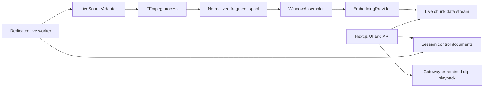

# Architecture Spine — Live Video Search

## Design Paradigm

Ports-and-adapters around a persistent streaming pipeline. Transport adapters
produce normalized fragments; control-plane, windowing, inference, indexing,
query, and playback depend on contracts rather than protocol implementations.



## Inherited Invariants

| Inherited | From parent | Binds here |
| --- | --- | --- |
| Provider identity and isolation | Existing file-video implementation | Every live variant and query |
| Dual visual/audio vectors with RRF | Existing embedding/search implementation | Window processing and retrieval |
| 1024 dimensions and provider byte budgets | Existing mappings and encoder | Proxies, mappings, and inference |
| Sanitized provenance and `.env` secrets | Repository security contract | Live source configuration |
| Bilingual EUI interface | Existing application shell | Live operations and search UI |

## Invariants & Rules

### AD-1 — Control plane and worker are separate

- **Binds:** CAP-1, CAP-2, CAP-3, CAP-5, CAP-7
- **Prevents:** A request timeout, deployment recycle, or dev reload silently terminating capture.
- **Rule:** Next.js may request desired state and read results; only a dedicated Node worker owns FFmpeg processes, window work, and observed runtime state.

### AD-2 — Protocols terminate at one adapter boundary

- **Binds:** CAP-1, CAP-8
- **Prevents:** Protocol-specific credentials, retries, and timestamp behavior leaking through the pipeline.
- **Rule:** Every source implements `LiveSourceAdapter`; RTSP/TCP is first, HLS and SRT are additional adapters, and WHIP terminates at MediaMTX before worker consumption.

### AD-3 — Only finalized media is embedded

- **Binds:** CAP-2, CAP-3, CAP-7
- **Prevents:** Invalid partial containers, inconsistent windows, and model inputs that change after indexing.
- **Rule:** Capture transcodes the selected video and optional audio tracks with
  FFmpeg's HLS muxer to canonical MPEG-TS fragments with forced 2-second
  keyframes, `temp_file`, `independent_segments`, and `program_date_time`. A
  playlist entry naming the renamed file finalizes it. `WindowAssembler` groups
  four consecutive fragments and advances three, recording actual PTS coverage;
  8 seconds and 6 seconds are targets, not cut points. It emits a standalone MP4
  and never hands an open fragment to inference.

### AD-4 — Reconnects create explicit time epochs

- **Binds:** CAP-2, CAP-4, CAP-6, CAP-7
- **Prevents:** Duplicate IDs and misleading timelines after PTS reset or source discontinuity.
- **Rule:** Window identity is `(session_id, stream_epoch, sequence_no)`; both counters start at 1, a manifest `epoch_started` record durably allocates each epoch, and the manifest allocates sequence before publication. Reconnect, worker restart, media-signature change, clock discontinuity, or PTS regression opens a new epoch; recovery reduces the manifest before selecting the next values.

### AD-5 — Runtime state has one writer

- **Binds:** CAP-1, CAP-5, CAP-7
- **Prevents:** API and worker updates clobbering connection state or counters.
- **Rule:** APIs mutate `desired_state`; the worker alone mutates `observed_state`, counters, timestamps, and monotonic `revision` using optimistic concurrency. Session creation first claims a deterministic session ID on the source with compare-and-set, then idempotently creates the session; startup and terminal transitions reconcile incomplete claims. The one-stream MVP permits exactly one worker process, enforced by a process-lifetime OS lock at `${LIVE_SPOOL_DIR}/.worker.lock`, one worker replica, and one web replica; failure to acquire the worker lock is fatal. Multi-host fencing is deferred.

### AD-6 — Spool acknowledgment defines recovery

- **Binds:** CAP-3, CAP-7
- **Prevents:** Lost finalized windows or duplicate semantic records after restart.
- **Rule:** A versioned append-only manifest is the recovery oracle. It records sequence allocation before atomic file publication and records abandoned allocations and orphan reconciliation after crashes. Records cover epoch, fragment, window, processed draft, attempt, event intent/readiness/publication, acknowledgment, failure, incomplete tail, drop, and expiry. Finalized media remains replay-protected until terminal acknowledgment or a durably recorded drop, then remains in the same store under playback retention until expiry. Recovery processes all nonterminal work, including stopped sessions, before selecting desired-running sessions. Before recreating a chunk or event, it queries its full data stream by logical ID because `_id` conflicts do not span backing indices.

### AD-7 — Searchability uses a recoverable outbox

- **Binds:** CAP-3, CAP-4, CAP-5
- **Prevents:** UI notifications pointing to documents not yet visible to search.
- **Rule:** Visual and optional audio inference run concurrently under the provider gate. No-audio is valid; failure of video or present-audio preparation/inference fails the whole window after bounded retry and creates no partial chunk. Before indexing, the manifest records a generic `event_intent` with a reserved session revision and reconstructable seed. Ready windows enter bounded waiting and in-flight indexing queues and are micro-batched asynchronously with one bulk `refresh=wait_for`. After visibility, the worker persists the complete event, create-indexes or fingerprint-verifies it at the reserved revision, and appends terminal `index_ack`. Recovery reconciles every nonterminal intent, including an indexed chunk whose event was not published.

### AD-8 — Live and file storage remain separate

- **Binds:** CAP-3, CAP-4, CAP-7
- **Prevents:** Strict-mapping collisions and file-oriented lifecycle rules corrupting live retention.
- **Rule:** `live-video-sources`, `live-video-sessions`, and `live-video-workers` are control indices; the worker heartbeat uses fixed document ID `singleton` and a generated process ID field. `live-video-chunks` and `live-video-events` are create-only data streams with Data Stream Lifecycle; existing file indices are unchanged. Events use `(session_id, revision)` identity and retain per-window searchable acknowledgments and state transitions. Logical uniqueness across rollover is enforced by recovery-time ID lookup and fingerprint verification; live search collapses results by `chunk_id` as defense in depth. No local Elasticsearch service or container is installed or composed; every process reads `ELASTICSEARCH_URL` and `ELASTICSEARCH_API_KEY` from `.env` and uses only that external instance.

### AD-9 — Following a query does not repeat inference

- **Binds:** CAP-4
- **Prevents:** Polling cost and latency increasing linearly with live refresh frequency.
- **Rule:** Search accepts an index target and live filters; `variant_id` is required. The server caches unchanged text or image query vectors in one web process for a bounded TTL while retrieval reruns after durable `searchable` events. Follow mode requires explicit session IDs, and a handle carries a revision cursor per selected session. The MVP runs one web replica; web restart invalidates the handle with `410 LIVE_QUERY_EXPIRED`, and clients may recreate it without reusing stale cursors.

### AD-10 — Live viewing and semantic clips are independent

- **Binds:** CAP-6
- **Prevents:** Search playback depending on an active source or semantic indexing depending on a browser player.
- **Rule:** Search results play retained immutable window clips; current live viewing uses gateway HLS/WebRTC when configured and is not an embedding input contract.

### AD-11 — Remote input is deny-by-default

- **Binds:** CAP-1, CAP-8
- **Prevents:** SSRF, local file reads through FFmpeg, credential leaks, and shell injection.
- **Rule:** The API validates only source metadata and an allowlisted credential-reference name, then stores `pending_validation`. Only the worker can read source secrets. It resolves structured credential material, validates protocol, every resolved address, host, and port before every connection, and writes only sanitized provenance plus `ready` or `invalid`. A reconnect must match the snapshotted endpoint fingerprint. FFmpeg is spawned with argument arrays and an adapter-specific protocol whitelist, and container egress policy binds the validated destination to the actual connection.

### AD-12 — Backpressure is observable and bounded

- **Binds:** CAP-2, CAP-5, CAP-7
- **Prevents:** Unbounded memory/disk growth and silent loss when inference is slower than capture.
- **Rule:** Queue, indexing acknowledgments, recoverable-input spool, retained-media, and reserved manifest headroom are bounded separately. Threshold breach moves the session to `degraded`; at a hard work limit the MVP atomically claims and durably drops the oldest queued, non-processing window, ordered by epoch then sequence. A durably recorded drop is the only exception to replaying finalized unacknowledged work. If no window is droppable or the terminal record cannot be persisted, capture stops and the session fails.

### AD-13 — Latency is measured by stage timestamps

- **Binds:** CAP-3, CAP-5
- **Prevents:** Averages hiding capture, inference, or refresh regressions.
- **Rule:** Record `worker_boot_id` plus monotonic/UTC timestamp pairs for `fragment_closed`, `window_closed`, `inference_started`, `inference_finished`, `index_requested`, `indexed`, and `searchable`, with queue depth and reconnect count. Same-boot durations use monotonic differences. Cross-boot recovery uses conservative UTC elapsed time with recorded uncertainty and is labeled `cross_boot`; monotonic values from different boots are never subtracted. Capture lag remains separate.

### AD-14 — Sources and sessions are immutable where reconnect depends on them

- **Binds:** CAP-1, CAP-7, CAP-8
- **Prevents:** A reconnect silently switching to patched connection settings or losing a secret-bearing endpoint after restart.
- **Rule:** A source initially stores only operator metadata plus an environment-backed `connection_ref` name. The worker validates it and stores safe display provenance. Session creation snapshots source revision, protocol, transport, connection ref, endpoint fingerprint, destination policy, variant, and media settings. Reconnect resolves the reference and rejects a fingerprint change. At most one nonterminal session exists per source; restart after a terminal state creates a new session, while epochs represent discontinuities within one run.

### AD-15 — Durable events are the replay and follow authority

- **Binds:** CAP-4, CAP-5, CAP-7
- **Prevents:** Process-local SSE loss and unrelated session revisions being compared as one scalar.
- **Rule:** Every externally visible worker mutation uses one serialized event writer that records generic intent in the manifest, reserves the session revision/state by optimistic concurrency, persists the completed event payload, and then create-indexes one typed `live-video-events` record. A missing reserved revision is recoverable from that intent; otherwise recovery emits `recovery_gap` plus a current snapshot. SSE replays by session and revision within event retention; follow search stores a per-session revision map, never a maximum scalar.

### AD-16 — Event time uses a recorded receive anchor

- **Binds:** CAP-2, CAP-4, CAP-5, CAP-6
- **Prevents:** Relative stream PTS being misrepresented as sender UTC.
- **Rule:** The RTSP MVP uses HLS `program_date_time` as the fragment wall-clock
  anchor and samples worker UTC plus `process.hrtime.bigint()` when the playlist
  finalization entry is observed. The spread is persisted as uncertainty and
  must be no greater than one fragment in the Phase 2 fixture. Event UTC is the
  anchor plus PTS delta; stage durations are persisted as monotonic elapsed
  values. Source-derived absolute clocks require a future adapter decision.

### AD-17 — Session and source transitions are explicit

- **Binds:** CAP-1, CAP-5, CAP-7
- **Prevents:** Ambiguous restarts, disabling an active source, and inconsistent terminal history.
- **Rule:** Session creation always requests `running`; there is no dormant session. Start is idempotent only while a session is nonterminal. `created -> connecting -> live`, `connecting/live -> degraded`, `degraded -> live`, `created/connecting/live/degraded -> stopping -> stopped`, and any nonterminal state to `failed` are the only transitions. The normative reason-code union lives in `docs/live-video-state-recovery.md`. Disabling a source prevents future sessions but does not terminate an active session; stop it explicitly.

## Consistency Conventions

| Concern | Convention |
| --- | --- |
| IDs | Lowercase UUIDs for source/session; document ID concatenates session ID, stream epoch, and sequence number with underscores |
| Time | UTC ISO 8601 plus monotonic stage durations; `@timestamp` is receive-anchored window end event-time |
| State | Commands set desired state; worker reports observed state and revision |
| Events | `snake_case`; create-only identity is session plus revision; envelope carries typed payload and manifest correlation |
| Errors | Stable uppercase code plus sanitized message; protocol secrets and absolute spool paths excluded |
| Config | `LIVE_` environment prefix; credentials referenced indirectly and never returned |
| Ownership | Worker owns secrets, source validation, media/spool/runtime; Elasticsearch owns shared state; APIs own public input validation and commands |

## Stack

| Name | Version |
| --- | --- |
| Node.js | repository baseline 22.x; worker image tag and digest must be pinned before Phase 2 |
| Next.js | 14.2.35 |
| React | 18.3.1 |
| Elastic EUI | 119.1.0 |
| FFmpeg | host-observed 8.1.1; exact worker build and capability manifest are a Phase 1 precondition |
| MediaMTX | 1.21.0 |
| Elasticsearch Serverless | observed 9.6.0 |
| jina-embeddings-v5-omni-small | 1024 dimensions |
| WHIP | RFC 9725 |

## Structural Seed

```text
app/api/live/                 # control, status, events, search, clip routes
app/live/                     # live operations and search UI
lib/live/contracts.ts         # protocol-neutral entities and events
lib/live/source/              # RTSP first; HLS and SRT adapters later
lib/live/window/              # fragment manifest and window assembler
lib/live/security/            # destination policy and provenance redaction
lib/live/search/              # live filters and query-vector cache
worker/live-worker.ts         # process supervisor and pipeline owner
scripts/live-fixture.ts       # deterministic MediaMTX/FFmpeg fixture
data/live-spool/              # recoverable fragments, windows, manifests
live-video-events             # durable session/event replay data stream
live-video-workers            # singleton heartbeat and capabilities index
```

## Capability → Architecture Map

| Capability | Lives in | Governed by |
| --- | --- | --- |
| CAP-1 | control API, session repository, source adapters | AD-1, AD-2, AD-5, AD-11, AD-14, AD-17 |
| CAP-2 | fragmenter and window assembler | AD-3, AD-4, AD-12 |
| CAP-3 | live worker, providers, chunk repository | AD-6, AD-7, AD-8 |
| CAP-4 | live search service and UI | AD-4, AD-8, AD-9 |
| CAP-5 | session state, event data stream, metrics | AD-5, AD-12, AD-13, AD-15, AD-17 |
| CAP-6 | retained clip route and gateway player | AD-4, AD-10 |
| CAP-7 | spool manifest and recovery scanner | AD-4, AD-6, AD-7 |
| CAP-8 | source policy and credential resolver | AD-2, AD-11 |

## Deferred

- HLS and SRT adapters follow RTSP acceptance because they do not change the pipeline contract.
- Browser WHIP publishing follows a confirmed release need; MediaMTX owns signaling and media termination.
- Multi-host worker fencing, Redis/Kafka queues, and horizontal scaling wait for a simultaneous-stream target above one; the MVP singleton lock remains mandatory.
- Alerting and saved continuous queries are separate capabilities after interactive live search is accepted.
- Production authentication and per-user authorization wait for an explicit deployment audience.
- Retention values remain assumptions until the operator selects vector, thumbnail, and clip policies.
